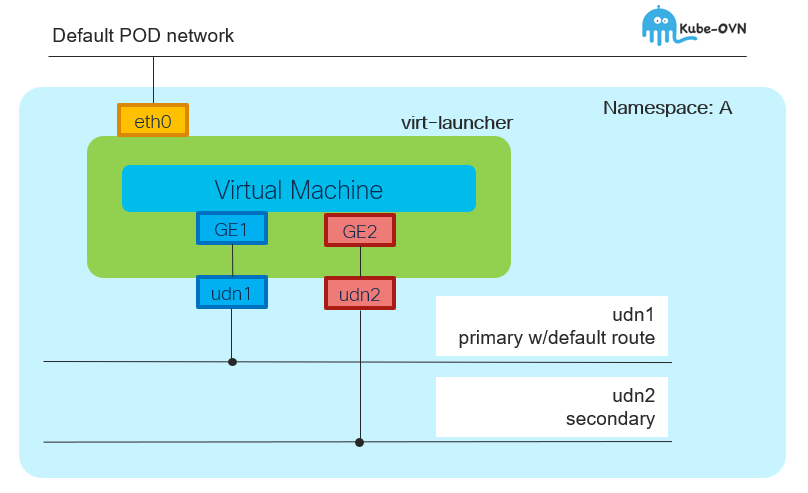

# UDN and Virtual Machine - Overview

[[Back]](../README.md) [[Prev]](../get/vm.md) [[Next]](../create/vm_crd.md)



## Default pod network

- virt-launcher pod connects to pod network
- kvm virtual machine may not connect to pod network (in the picture and example it does not)

## Primary UDN

Virtual machine deployed in namespace that is 
- udn-enabled
- associated with primary udn

Virtual machine connected to user-defined primary network *only* as los as binding `l2bridge` is configured on the primary network interface. Virtual machine connects to default pod network in masquerade mode otherwise.

Example using cat8000v virtual machine

```
c8kv2#show ip int brief
Interface              IP-Address      OK? Method Status                Protocol
GigabitEthernet1       66.66.0.23      YES DHCP   up                    up
```

```
c8kv2#show ip route
S*    0.0.0.0/0 [254/0] via 66.66.0.1
      66.0.0.0/8 is variably subnetted, 2 subnets, 2 masks
C        66.66.0.0/24 is directly connected, GigabitEthernet1
L        66.66.0.23/32 is directly connected, GigabitEthernet1
```

## Secondary UDN

Connection to secondary user-defined networks pre-configured in the same namespace as POD must be configured in multus-way

```
c8kv3#show ip int brief
Interface              IP-Address      OK? Method Status                Protocol
GigabitEthernet1       66.66.0.30      YES DHCP   up                    up
GigabitEthernet2       66.66.1.9       YES DHCP   up                    up
```

```
# show ip route
S*    0.0.0.0/0 [254/0] via 66.66.0.1
      66.0.0.0/8 is variably subnetted, 4 subnets, 2 masks
C        66.66.0.0/24 is directly connected, GigabitEthernet1
L        66.66.0.30/32 is directly connected, GigabitEthernet1
C        66.66.1.0/24 is directly connected, GigabitEthernet2
L        66.66.1.9/32 is directly connected, GigabitEthernet2
```

[[Back]](../README.md) [[Prev]](../get/vm.md) [[Next]](../create/vm_crd.md)