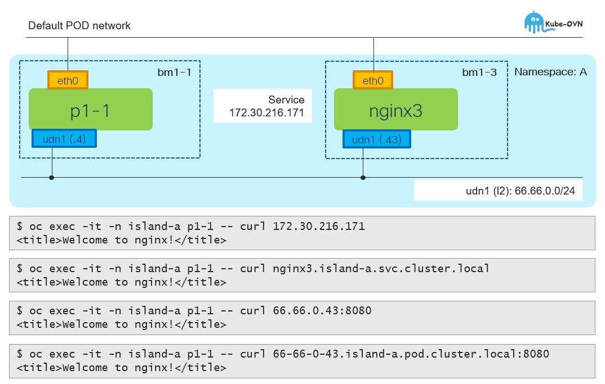

# Intra-udn traffic - network policy

[[Back]](../README.md)



## Step 1: Block all

> [!NOTE]
> Intra-udn communication effectively disabled

```
kind: NetworkPolicy
apiVersion: networking.k8s.io/v1
metadata:
 name: deny-all
 namespace: island-a
spec:
 podSelector: {}
 policyTypes:
   - Ingress
```

## Step 2: Allow port 8080

> [!NOTE]
> Intra-udn communication allowed for TCP:8080 only

```
kind: NetworkPolicy
apiVersion: networking.k8s.io/v1
metadata:
 name: allow-http
 namespace: island-a
spec:
 podSelector: {}
 ingress:
   - ports:
       - protocol: TCP
         port: 8080
     from:
       - podSelector: {}
 policyTypes:
   - Ingress
```

[[Back]](../README.md)