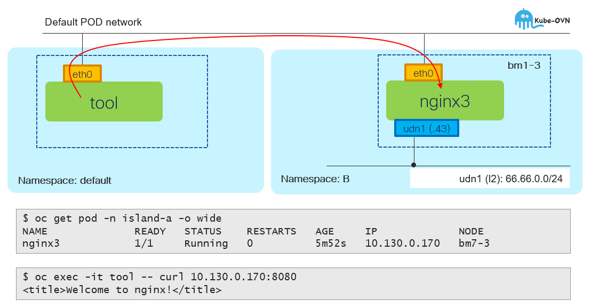

# UDN - Opening incoming connections from default namespace

[[Back]](../README.md)



## CRD

```
apiVersion: v1
kind: Pod
metadata:
  annotations:
    k8s.ovn.org/open-default-ports: '[{"protocol": "tcp", "port": 8080}]'
  labels:
    app: nginx3
  name: nginx3
  namespace: island-a
spec:
  containers:
  - image: nginxinc/nginx-unprivileged
    name: nginx
  nodeName: bm1-3
```

## IP Stack

```
$ oc get pod -n island-a -o wide
NAME         READY   STATUS    RESTARTS   AGE     IP             NODE   
nginx3       1/1     Running   0          5m52s   10.130.0.170   bm1-3  
```

```
$ oc get pod -n default
NAME   READY   STATUS    RESTARTS   AGE
tool   1/1     Running   0          8m24s
```

## Test

```
$ oc exec -it tool -- curl 10.130.0.170:8080
<!DOCTYPE html>
<html>
<head>
<title>Welcome to nginx!</title>
```

[[Back]](../README.md)