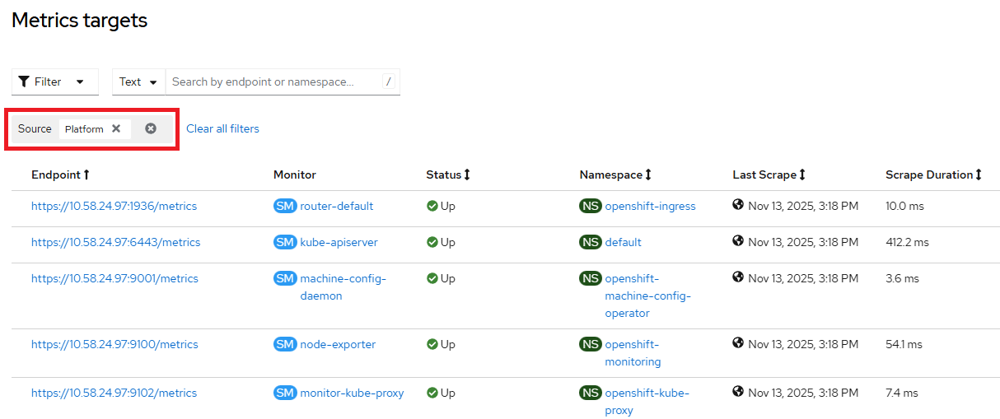

# Prometheus Operator - Platform metrics targets via cli

Platform metrics targets can be checked via Console UI in Observe => Targets page e.g.,



There is no api-resource that exposes the information as above directly in Kubernetes CRD. Platform metrics targets can be collected via prometheus pod

```
$ oc -n openshift-monitoring exec -c prometheus prometheus-k8s-0 -- curl -k http://localhost:9090/api/v1/targets | jq . 
{
  "status": "success",
  "data": {
    "activeTargets": [
      {
        "discoveredLabels": {
          "__address__": "10.128.0.60:8443",
          "__meta_kubernetes_endpoint_address_target_kind": "Pod",
          "__meta_kubernetes_endpoint_address_target_name": "openshift-apiserver-operator-b9ff4697-xzqb8",
          "__meta_kubernetes_endpoint_node_name": "bm3-2",
          "__meta_kubernetes_endpoint_port_name": "https",
          "__meta_kubernetes_endpoint_port_protocol": "TCP",
          "__meta_kubernetes_endpoint_ready": "true",
          "__meta_kubernetes_endpoints_annotation_endpoints_kubernetes_io_last_change_trigger_time": "2025-10-30T20:33:56Z",
          "__meta_kubernetes_endpoints_annotationpresent_endpoints_kubernetes_io_last_change_trigger_time": "true",
          "__meta_kubernetes_endpoints_label_app": "openshift-apiserver-operator",
          "__meta_kubernetes_endpoints_labelpresent_app": "true",
          "__meta_kubernetes_endpoints_name": "metrics",
          "__meta_kubernetes_namespace": "openshift-apiserver-operator",
```

Refer to [iserver-way](./targets.md) of getting this data.

[[Back]](./README.md)
