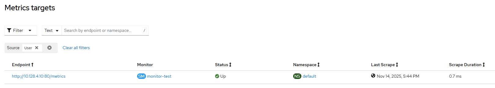
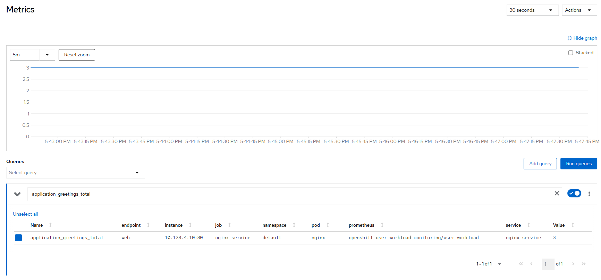

# Prometheus Operator - Service monitor via cli

## Goal

- create basic nginx-based pod that exposes static metric
- create service for nginx
- create service monitor
- check metric in Console UI

## Step 1: Define pvc

```
apiVersion: v1
kind: PersistentVolumeClaim
metadata:
  name: pvc0001
spec:
  resources:
    requests:
      storage: 1Gi
  volumeMode: Filesystem
  accessModes:
    - ReadWriteOnce
  storageClassName: lvms-vg1
```

## Step 2: Populate data in pvc

```
apiVersion: v1
kind: Pod
metadata:
  name: pod-pvc
spec:
  containers:
  - command:
    - /bin/sleep
    - infinity
    image: quay.io/centos/centos:latest
    name: centos
    volumeMounts:
    - mountPath: /pvc
      name: data
  volumes:
  - name: data
    persistentVolumeClaim:
      claimName: pvc0001
```

once pod is ready, use 'kubectl cp' to upload the file that will endup on pvc

```
# HELP application_greetings_total How many greetings we've given.
# TYPE application_greetings_total counter
application_greetings_total 3.0
```

kill pod when done

## Step 3: Start pod, service and service monitor

```
apiVersion: v1
kind: Pod
metadata:
  name: nginx
  labels:
    app: nginx
spec:
  containers:
  - image: nginx
    name: nginx
    volumeMounts:
    - mountPath: /usr/share/nginx/html
      name: data
  volumes:
  - name: data
    persistentVolumeClaim:
      claimName: pvc0001
---
apiVersion: v1
kind: Service
metadata:
  name: nginx-service
  labels:
    app: nginx-svc
spec:
  type: NodePort
  selector:
    app: nginx
  ports:
    - name: web
      port: 80
      targetPort: 80
---
apiVersion: monitoring.coreos.com/v1
kind: ServiceMonitor
metadata:
  name: monitor-test
spec:
  endpoints:
  - interval: 30s
    port: web
    scheme: http
    path: /metrics
  selector:
    matchLabels:
      app: nginx-svc
```

```
$ oc get pod -o wide
NAME                               READY   STATUS    RESTARTS      AGE   IP             NODE    
nginx                              1/1     Running   0             36m   10.128.5.93    bm1-3   

$ oc get service
NAME             TYPE           CLUSTER-IP       EXTERNAL-IP                            PORT(S)                               AGE
nginx-service    NodePort       172.30.175.8     <none>                                 80:31247/TCP                          34m

$ curl 172.30.175.8/metrics
# HELP application_greetings_total How many greetings we've given.
# TYPE application_greetings_total counter
application_greetings_total 3.0

$ oc get ep
NAME             ENDPOINTS                                                           AGE
nginx-service    10.128.5.93:80                                                      35m

$ oc get servicemonitors
NAME           AGE
monitor-test   36m
```

## Step 4: verify





```
# iserver get k8s smon --namespace default --cluster bm1

+----+-----------------+-------+---------------+---------------+--------+
| ID | Service Monitor | Owner | Endpoint      | POD           | Target |
+----+-----------------+-------+---------------+---------------+--------+
| 1  | default         | ---   | default       | default/nginx | ✓      | 
|    | monitor-test    |       | nginx-service |               |        |
+----+-----------------+-------+---------------+---------------+--------+
```

[[Back]](./README.md)
