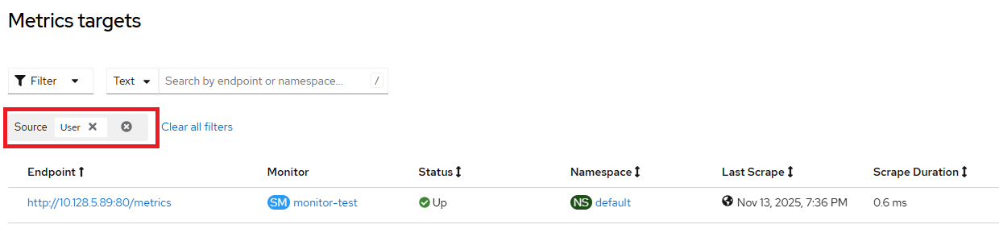

# Prometheus Operator - User metrics targets via cli

User metrics targets can be checked via Console UI in Observe => Targets page e.g.,



There is no api-resource that exposes the information as above directly in Kubernetes CRD. User metrics targets can be collected via prometheus pod deployed when user workload monitoring is [enabled](./enable_user_workload_monitoring.md)

```
$ oc -n openshift-user-workload-monitoring exec -c prometheus prometheus-user-workload-0 -- curl -k http://localhost:9090/api/v1/targets | jq .
{
  "status": "success",
  "data": {
    "activeTargets": [
      {
        "discoveredLabels": {
          "__address__": "10.128.5.89:80",
          "__meta_kubernetes_endpoint_address_target_kind": "Pod",
          "__meta_kubernetes_endpoint_address_target_name": "nginx",
          "__meta_kubernetes_endpoint_node_name": "bm3-3",
          "__meta_kubernetes_endpoint_port_name": "web",
          "__meta_kubernetes_endpoint_port_protocol": "TCP",
          "__meta_kubernetes_endpoint_ready": "true",
          "__meta_kubernetes_endpoints_annotation_endpoints_kubernetes_io_last_change_trigger_time": "2025-11-13T13:52:39Z",
          "__meta_kubernetes_endpoints_annotationpresent_endpoints_kubernetes_io_last_change_trigger_time": "true",
          "__meta_kubernetes_endpoints_label_app": "nginx",
          "__meta_kubernetes_endpoints_labelpresent_app": "true",
          "__meta_kubernetes_endpoints_name": "nginx-service",
          "__meta_kubernetes_namespace": "default",

```

Refer to [iserver-way](./targets.md) of getting this data.

[[Back]](./README.md)
