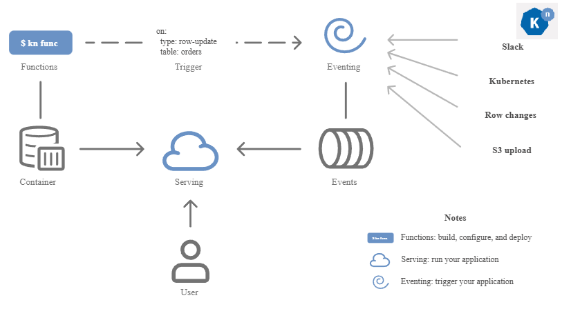

# Serverless Operator

[Knative](https://knative.dev/docs/) is a Kubernetes-based platform that provides a complete set of middleware components for building, deploying, and managing modern serverless workloads. Knative extends Kubernetes to provide higher-level abstractions that simplify the development and operation of cloud-native applications.

OpenShift Serverless Operator enables you to install and use [Knative Serving](https://knative.dev/docs/serving/), [Knative Eventing](https://knative.dev/docs/eventing/), and Knative Kafka on a OpenShift Container Platform cluster. It manages Knative custom resource definitions (CRDs) for your cluster and enables you to configure them without directly modifying individual config maps for each component.

Refer to official [OpenShift documentation](https://docs.redhat.com/it/documentation/openshift_container_platform/4.19/html-single/serverless/index) for details.

## Life Cycle Management Commands

Command | Intent | Details
--- | --- | ---
iserver get ocp serverless | check the serverless operator state | [Link](./get.md)
iserver set ocp serverless | install serverless operator | [Link](./create_operator.md)
iserver set ocp task | in task way | [Link](./create_task.md)
iserver delete ocp serverless | uninstall serverless operator | [Link](./delete_operator.md)
iserver delete ocp task | in task way | [Link](./delete_task.md)

[[Back]](../Operations.md)