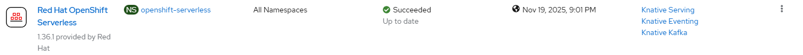

# Serverless Operator - Create via Task

## Input

```
[
    {
        "serverless": {
            "operator": {
                "channel": "__default__"
            }
        }
    }
]
```

Notes:
- [operator](./create_operator.md) trigger workflow execution with optional input parameters

## Requirements

None

## Expected outcome



## Configurable options

```
# iserver set ocp task 
  --cluster TEXT   Cluster Name
  --filename TEXT  Tasks filename
  --validate       Validate only
  --break          Break on error
  --no-confirm     Confirmation mode
```

## Example

```
# iserver set ocp task --filename C:\tmp\task.json --no-confirm --cluster bm1

Cluster: bm1 (type: ocp)

OpenShift Workflow - Create Tasks
=================================

Validate Input
--------------
Completed


OpenShift Workflow - Serverless Operator - Create Operator
==========================================================

OpenShift Cluster: bm1

Create Namespace
----------------
- name: openshift-serverless

~~~
apiVersion: v1
kind: Namespace
metadata:
  name: openshift-serverless

~~~

Namespace created

Wait for namespace [timeout:60]...

Create Operator Group
---------------------
Operator group: openshift-serverless/serverless-operator-group

~~~
apiVersion: operators.coreos.com/v1
kind: OperatorGroup
metadata:
  name: serverless-operator-group
  namespace: openshift-serverless
spec:
  upgradeStrategy: Default

~~~

Operator group created

Wait for operator group [timeout:60]...

Create Subscription
-------------------
Subscription: openshift-serverless/serverless-operator
Source: openshift-marketplace/redhat-operators/serverless-operator
Install plan approval: Automatic
Getting subscription and packege manifest information...
Channel: stable
- CSV [serverless-operator.v1.36.1]
- CSV Display name [Red Hat OpenShift Serverless]
- CVS Version [1.36.1]
- CSV Provider [{'name': 'Red Hat'}]
- CSV Maturity [stable]

~~~
apiVersion: operators.coreos.com/v1alpha1
kind: Subscription
metadata:
  name: serverless-operator
  namespace: openshift-serverless
spec:
  channel: stable
  installPlanApproval: Automatic
  name: serverless-operator
  source: redhat-operators
  sourceNamespace: openshift-marketplace

~~~

Subscription created

Wait for subscription install plan started [timeout:360]...
Install plan: install-c2q7p
Wait for subscription install plan ready [timeout:600]...
Install plan succeeded
Wait for deployments ready (optional: True, allow zero replicas: False)...
- openshift-serverless/knative-openshift
- openshift-serverless/knative-openshift-ingress
- openshift-serverless/knative-operator-webhook

Completed tasks
- Namespace created
- Operator Group created
- Serversless operator installed
```

[[Back]](./README.md)