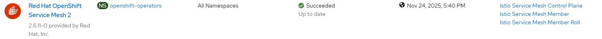

# Service Mesh Operator - Create Operator

## Workflow

- create subscription with user controlled channel or defaultChannelName
- wait for operator resources

## Requirements

None

## Expected outcome



## Configurable options

```
# iserver set ocp service-mesh --mode operator
  --cluster TEXT     Cluster Name
  --channel TEXT     Operator channel  [default: __default__]
  --no-confirm       Confirmation mode
```

## Example

```
# iserver set ocp service-mesh --mode operator --cluster bm1 --no-confirm

OpenShift Workflow - Service Mesh Operator - Create Operator
============================================================

OpenShift Cluster: bm1

Create Namespace
----------------
- name: openshift-operators
- already defined

Create Subscription
-------------------
Subscription: openshift-operators/servicemeshoperator3
Source: openshift-marketplace/redhat-operators/servicemeshoperator3
Install plan approval: Automatic
Getting subscription and packege manifest information...
Resolving channel name...
Channel: stable
- CSV [servicemeshoperator3.v3.2.0]
- CSV Display name [Red Hat OpenShift Service Mesh 3]
- CVS Version [3.2.0]
- CSV Provider [{'name': 'Red Hat, Inc.'}]
- CSV Maturity [alpha]

~~~
apiVersion: operators.coreos.com/v1alpha1
kind: Subscription
metadata:
  name: servicemeshoperator3
  namespace: openshift-operators
spec:
  channel: stable
  installPlanApproval: Automatic
  name: servicemeshoperator3
  source: redhat-operators
  sourceNamespace: openshift-marketplace
  startingCSV: servicemeshoperator3.v3.2.0

~~~

Subscription created

Wait for subscription install plan started [timeout:360]...
Install plan: install-49b7z
Wait for subscription install plan ready [timeout:600]...
Install plan succeeded
Wait for deployments ready (optional: True, allow zero replicas: False)...
- openshift-operators/servicemesh-operator3

Completed tasks
- Namespace created
- Operator Group created
- Service mesh operator installed
```

[[Back]](./README.md)