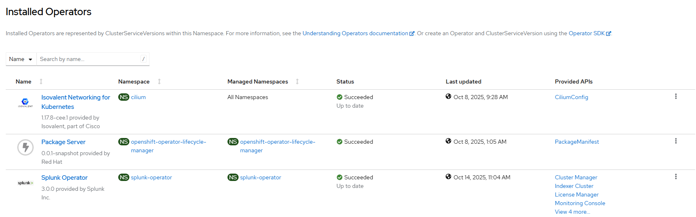

# Splunk Operator - Create All

## Workflow

Workflows deployed in sequence
- [create operator](./create_operator.md)
- [create instance](./create_instance.md)

## Requirements

- storage subsystem e.g. [LVM](../lvm/README.md), [ODF](../odf/README.md)
- default storage class used to create PVCs for splunk standalone instance

## Configurable options

```
# iserver set ocp splunk --mode all
  --cluster TEXT                  Cluster Name
  --channel TEXT                  Operator channel  [default: __default__]
  --instance TEXT                 Standalone instance name
  --no-route                      Instance route
  --no-confirm                    Confirmation mode
```

## Expected Outcome

- splunk operator installed
- standalone instance created and ready to use




## Example

```
# iserver set ocp splunk --mode all --cluster bm1 --instance s1 --no-confirm


OpenShift Workflow - Splunk Operator - Create Operator
======================================================

Workflow Parameters
-------------------
{
    "cluster": "bm1",
    "channel": "__default__",
    "confirmation": false,
    "check-verbose": true,
    "namespace": "splunk-operator",
    "name": "splunk-operator",
    "operator-group-name": "splunk-operator-group",
    "license-at-splunk": true,
    "role-binding": true,
    "role-binding-name": "system:openshift:scc:nonroot-v2",
    "pvc-finalizers": true,
    "delete-namespace": false
}


OpenShift Cluster
-----------------
- cluster: bm1 [domain:*****]
- api [*****]: ok
- dns resolution: ok


Create Namespace
----------------
- name: splunk-operator
- already defined

Create Operator Group
---------------------
Operator group: splunk-operator/splunk-operator-group
Target namespaces: splunk-operator

~~~
apiVersion: operators.coreos.com/v1
kind: OperatorGroup
metadata:
  name: splunk-operator-group
  namespace: splunk-operator
spec:
  targetNamespaces:
  - splunk-operator

~~~

Operator group created

Wait for operator group [timeout:60]...

Create Subscription
-------------------
Subscription: splunk-operator/splunk-operator
Source: openshift-marketplace/certified-operators/splunk-operator
Install plan approval: Automatic
Getting subscription and packege manifest information...
Resolving channel name...
Channel: stable
- CSV [splunk-operator.v3.0.0]
- CSV Display name [Splunk Operator]
- CVS Version [3.0.0]
- CSV Provider [{'name': 'Splunk Inc.', 'url': 'www.splunk.com'}]
- CSV Maturity [stable]

~~~
apiVersion: operators.coreos.com/v1alpha1
kind: Subscription
metadata:
  name: splunk-operator
  namespace: splunk-operator
spec:
  channel: stable
  installPlanApproval: Automatic
  name: splunk-operator
  source: certified-operators
  sourceNamespace: openshift-marketplace

~~~

Subscription created

Wait for subscription install plan started [timeout:360]...
Install plan: install-t9dsg
Wait for subscription install plan ready [timeout:600]...
Install plan succeeded
Wait for deployments ready (optional: True, allow zero replicas: False)...
- splunk-operator/splunk-operator-controller-manager

Set Splunk operator subscription license
- subscription package: splunk-operator
- subscription found
- csv splunk-operator/splunk-operator
- csv found
- set env SPLUNK_GENERAL_TERMS value to --accept-sgt-current-at-splunk-com
- csv patched
- delete deployment splunk-operator/splunk-operator-controller-manager
- wait for deployment ready

Set OpenShift policy for Splunk operator
- subscription package: splunk-operator
- subscription found
- csv splunk-operator/splunk-operator
- csv found

Create role binding
-------------------
- namespace: splunk-operator
- name: system:openshift:scc:nonroot-v2
- cluster role: system:openshift:scc:nonroot-v2
- service account namespace: splunk-operator
- service account name: default

~~~
apiVersion: rbac.authorization.k8s.io/v1
kind: RoleBinding
metadata:
  name: system:openshift:scc:nonroot-v2
  namespace: splunk-operator
roleRef:
  apiGroup: rbac.authorization.k8s.io
  kind: ClusterRole
  name: system:openshift:scc:nonroot-v2
subjects:
- kind: ServiceAccount
  name: default
  namespace: splunk-operator

~~~

Role binding created
- delete deployment splunk-operator/splunk-operator-controller-manager
- wait for deployment ready


Operator
--------
- subscription          : splunk-operator/splunk-operator
- package               : openshift-marketplace/certified-operators/splunk-operator
- channel               : stable
- install plan          : splunk-operator/install-t9dsg
- install plan approved : ✓
- installed csv         : splunk-operator.v3.0.0
- latest_csv            : ✓


Completed tasks
- Namespace created
- Operator Group created
- Splunk Operator installed
- Splunk license accept at splunk.com set
- Role binding created

OpenShift Workflow - Splunk Operator - Create Instance
======================================================

Workflow Parameters
-------------------
{
    "cluster": "bm1",
    "instance": "s1",
    "route": true,
    "confirmation": false,
    "check-verbose": true,
    "namespace": "splunk-operator",
    "name": "splunk-operator",
    "operator-group-name": "splunk-operator-group",
    "license-at-splunk": true,
    "role-binding": true,
    "role-binding-name": "system:openshift:scc:nonroot-v2",
    "pvc-finalizers": true,
    "delete-namespace": false
}


OpenShift Cluster
-----------------
- cluster: bm1 [domain:*****]
- api [*****]: ok
- dns resolution: ok


Create Splunk Standalone Cluster
--------------------------------
- namespace: splunk-operator
- name: s1

~~~
apiVersion: enterprise.splunk.com/v4
kind: Standalone
metadata:
  finalizers:
  - enterprise.splunk.com/delete-pvc
  name: s1
  namespace: splunk-operator
spec: {}

~~~

Standalone cluster created

Wait for pod splunk-operator/splunk-s1-standalone-0...
Wait for standalone ready splunk-operator/s1...

Create splunk instance route
----------------------------
- instance namespace: splunk-operator
- instance name: s1
- service namespace: splunk-operator
- service name: splunk-s1-standalone-service
- service found
- route namespace: splunk-operator
- route name: splunk-s1-standalone-service

~~~
apiVersion: route.openshift.io/v1
kind: Route
metadata:
  labels:
    app.kubernetes.io/component: standalone
    app.kubernetes.io/instance: splunk-s1-standalone
    app.kubernetes.io/managed-by: splunk-operator
    app.kubernetes.io/name: standalone
    app.kubernetes.io/part-of: splunk-s1-standalone
  name: splunk-s1-standalone-service
  namespace: splunk-operator
spec:
  host: splunk-s1-standalone-service-splunk-operator.apps.bm1.domain.com
  port:
    targetPort: http-splunkweb
  to:
    kind: Service
    name: splunk-s1-standalone-service
    weight: 100
  wildcardPolicy: null

~~~

Route created

Wait for route ready...

+----+-----------------+-------+-----+-----+---------+-------+--------------------------------------------------------------------------+
| ID | Standalone      | Ready | Pod | PVC | Service | Route | URL                                                                      |
+----+-----------------+-------+-----+-----+---------+-------+--------------------------------------------------------------------------+
| 1  | splunk-operator | ✓     | ✓   | 2/2 | ✓       | 1/1   | http://splunk-s1-standalone-service-splunk-operator.apps.bm1.domain.com | 
|    | s1              |       |     |     |         |       | (admin, password)                                                        | 
+----+-----------------+-------+-----+-----+---------+-------+--------------------------------------------------------------------------+

Completed tasks
- Standalone instance created
- Route configured
```

[[Back]](./README.md)