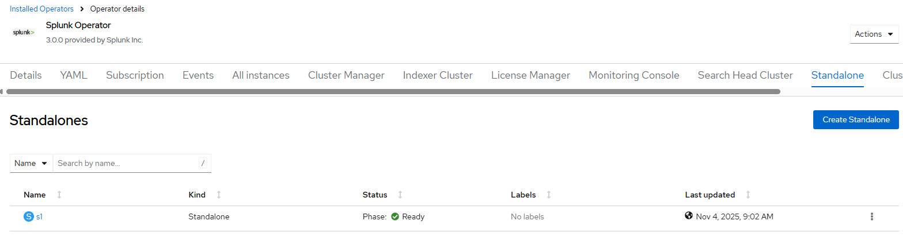
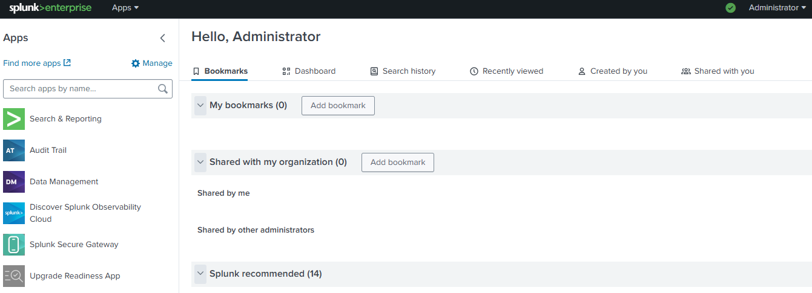

# Splunk Operator - Create Standalone Instance

## Workflow

- create standalone splunk instance
- create route
- wait for instance resources ready

## Requirements

- Splunk operator [created](./create_operator.md)
- storage subsystem e.g. [LVM](../lvm/README.md), [ODF](../odf/README.md)
- default storage class used to create PVCs for splunk standalone instance

## Configurable options

- route is created by default
- use --no-route flag to disable route create

```
# iserver set ocp splunk --mode instance
  --cluster TEXT                  Cluster Name
  --instance TEXT                 Standalone instance name
  --no-route                      Instance route
  --no-confirm                    Confirmation mode
```

## Non-configurable defaults

```
{
    "namespace": "splunk-operator",
    "pvc-finalizers": true
}
```

## Expected Outcome






## Example

```
# iserver set ocp splunk --mode instance --cluster bm1 --instance s1 --no-confirm

OpenShift Workflow - Splunk Operator - Create Instance
======================================================

Workflow Parameters
-------------------
{
    "cluster": "bm1",
    "instance": "s1",
    "route": true,
    "confirmation": false,
    "check-verbose": true,
    "namespace": "splunk-operator",
    "name": "splunk-operator",
    "operator-group-name": "splunk-operator-group",
    "license-at-splunk": true,
    "role-binding": true,
    "role-binding-name": "system:openshift:scc:nonroot-v2",
    "pvc-finalizers": true,
    "delete-namespace": true
}


OpenShift Cluster
-----------------
- cluster: bm1 [domain:*****]
- api [*****]: ok
- dns resolution: ok


Create Splunk Standalone Cluster
--------------------------------
- namespace: splunk-operator
- name: s1

~~~
apiVersion: enterprise.splunk.com/v4
kind: Standalone
metadata:
  finalizers:
  - enterprise.splunk.com/delete-pvc
  name: s1
  namespace: splunk-operator
spec: {}

~~~

Standalone cluster created

Wait for pod splunk-operator/splunk-s1-standalone-0...

Create splunk instance route
----------------------------
- instance namespace: splunk-operator
- instance name: s1
- service namespace: splunk-operator
- service name: splunk-s1-standalone-service
- service found
- route namespace: splunk-operator
- route name: splunk-s1-standalone-service

~~~
apiVersion: route.openshift.io/v1
kind: Route
metadata:
  labels:
    app.kubernetes.io/component: standalone
    app.kubernetes.io/instance: splunk-s1-standalone
    app.kubernetes.io/managed-by: splunk-operator
    app.kubernetes.io/name: standalone
    app.kubernetes.io/part-of: splunk-s1-standalone
  name: splunk-s1-standalone-service
  namespace: splunk-operator
spec:
  host: splunk-s1-standalone-service-splunk-operator.apps.bm1.domain.com
  port:
    targetPort: http-splunkweb
  to:
    kind: Service
    name: splunk-s1-standalone-service
    weight: 100
  wildcardPolicy: null

~~~

Route created

+----+-----------------+-------+-----+-----+---------+-------+--------------------------------------------------------------------------+
| ID | Standalone      | Ready | Pod | PVC | Service | Route | URL                                                                      |
+----+-----------------+-------+-----+-----+---------+-------+--------------------------------------------------------------------------+
| 1  | splunk-operator | ✓     | ✓   | 2/2 | ✓       | 1/1   | http://splunk-s1-standalone-service-splunk-operator.apps.bm1.domain.com |
|    | s1              |       |     |     |         |       | (admin, password)                                                        |
+----+-----------------+-------+-----+-----+---------+-------+--------------------------------------------------------------------------+

Completed tasks
- Standalone instance created
- Route configured
```

[[Back]](./README.md)