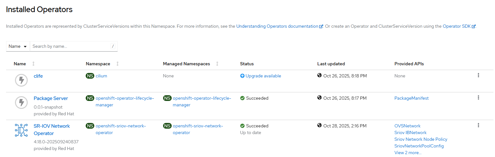
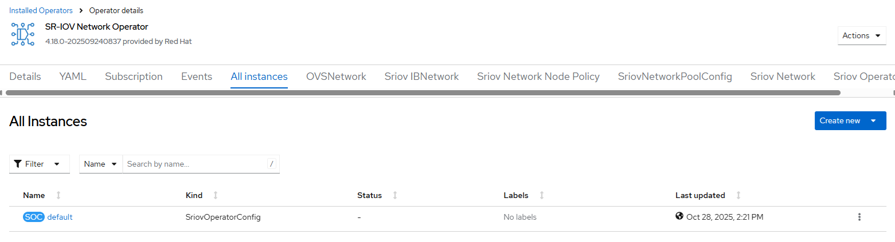

# SR-IOV Network Operator - Create Operator and Instance

## Workflow

Execute two workflows in sequence
- [create operator](./create_operator.md)
- [create instance](./create_instance.md)

## Requirements

None

## Expected Outcome





## Configurable options

```
# iserver set ocp sriov --mode all
  --cluster TEXT                  Cluster Name
  --channel TEXT                  Operator channel  [default: __default__]
  --no-confirm                    Confirmation mode
```

## Example

```
# iserver set ocp sriov --mode all --cluster bm1 --no-confirm


OpenShift Workflow - SRIOV Operator - Create Operator
=====================================================

Workflow Parameters
-------------------
{
    "cluster": "bm1",
    "channel": "__default__",
    "confirmation": false,
    "check-verbose": true,
    "namespace": "openshift-sriov-network-operator",
    "name": "sriov-network-operator",
    "operator-group-name": "sriov-operator-group",
    "config": {
        "name": "default",
        "injector": true,
        "webhook": true
    },
    "delete-namespace": true
}


OpenShift Cluster
-----------------
- cluster: bm1 [domain:local]
- api [C:\Users\user\.itool\ocp-clusters\bm1\kubeconfig]: ok
- dns resolution: ok


Create Namespace
----------------
- name: openshift-sriov-network-operator

~~~
apiVersion: v1
kind: Namespace
metadata:
  name: openshift-sriov-network-operator

~~~

Namespace created

Wait for namespace [timeout:60]...

Create Operator Group
---------------------
Operator group: openshift-sriov-network-operator/sriov-operator-group

~~~
apiVersion: operators.coreos.com/v1
kind: OperatorGroup
metadata:
  name: sriov-operator-group
  namespace: openshift-sriov-network-operator
spec:
  targetNamespaces:
  - openshift-sriov-network-operator
  upgradeStrategy: Default

~~~

Operator group created

Wait for operator group [timeout:60]...

Create Subscription
-------------------
Subscription: openshift-sriov-network-operator/sriov-network-operator
Source: openshift-marketplace/redhat-operators/sriov-network-operator
Install plan approval: Automatic
Getting subscription and packege manifest information...
Resolving channel name...
Channel: stable
- CSV [sriov-network-operator.v4.18.0-202509240837]
- CSV Display name [SR-IOV Network Operator]
- CVS Version [4.18.0-202509240837]
- CSV Provider [{'name': 'Red Hat'}]

~~~
apiVersion: operators.coreos.com/v1alpha1
kind: Subscription
metadata:
  name: sriov-network-operator
  namespace: openshift-sriov-network-operator
spec:
  channel: stable
  installPlanApproval: Automatic
  name: sriov-network-operator
  source: redhat-operators
  sourceNamespace: openshift-marketplace

~~~

Subscription created

Wait for subscription install plan started [timeout:360]...
Install plan: install-dmr97
Wait for subscription install plan ready [timeout:600]...
Install plan succeeded
Wait for deployments ready (optional: True, allow zero replicas: False)...
- openshift-sriov-network-operator/sriov-network-operator

Completed tasks
- Namespace created
- Operator Group created
- SRIOV Operator installed

OpenShift Workflow - SRIOV Operator - Create Instance
=====================================================

Workflow Parameters
-------------------
{
    "cluster": "bm1",
    "confirmation": false,
    "check-verbose": true,
    "namespace": "openshift-sriov-network-operator",
    "name": "sriov-network-operator",
    "operator-group-name": "sriov-operator-group",
    "config": {
        "name": "default",
        "injector": true,
        "webhook": true
    },
    "delete-namespace": true
}


OpenShift Cluster
-----------------
- cluster: bm1 [domain:local]
- api [C:\Users\user\.itool\ocp-clusters\bm1\kubeconfig]: ok
- dns resolution: ok


Create SRIOV Operator Config
----------------------------
- namespace: openshift-sriov-network-operator
- name: default
- injector: True
- webhook: True

~~~
apiVersion: sriovnetwork.openshift.io/v1
kind: SriovOperatorConfig
metadata:
  name: default
  namespace: openshift-sriov-network-operator
spec:
  enableInjector: true
  enableOperatorWebhook: true
  logLevel: 2

~~~

SRIOV operator config created

Wait for operator config [timeout:60]...
Wait for operator config resources...
Wait for deployments ready (optional: True, allow zero replicas: False)...
- openshift-sriov-network-operator/sriov-network-operator
Wait for deamon sets ready...
- openshift-sriov-network-operator/network-resources-injector
- openshift-sriov-network-operator/operator-webhook
- openshift-sriov-network-operator/sriov-network-config-daemon

- SRIOV Operator configuration created
```

[[Back]](./README.md)