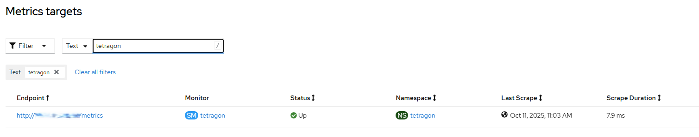

# Tetragon Enterprise Operator - Enable Prometheus 

## Overview

Tetragon exposes a number of Prometheus metrics that can be used for two main purposes:
- monitoring the health of Tetragon itself
- monitoring the activity of processes observed by Tetragon

The metrics are exposed in two steps:
- Service CRD exposes monitoring endpoint
- ServiceMonitor CRD informs user-workload enabled Prometheus on how to scrape the metrics

## Workflow

- [enable user-workload monitoring](../grafana/enable_monitoring.md)
- enable service monitor in tetragon agents

## Requirements

Tetragon Enterprise operator must be installed.

## Configurable options

```
# iserver set ocp tetragon --mode prometheus
  --cluster TEXT            Cluster Name
```

## Expected Outcome

Service Monitor for every cluster node. Example below on SNO



## Example

```
# iserver set ocp tetragon --mode prometheus --cluster bm1

OpenShift Workflow - Grafana Operator - Enable user-workload monitoring
=======================================================================

Workflow Parameters
-------------------
{
    "cluster": "bm1",
    "confirmation": true,
    "check-verbose": true,
    "namespace": "grafana-operator",
    "name": "grafana-operator",
    "operator-group-name": "grafana-operator-group",
    "mon-namespace": "openshift-monitoring",
    "mon-name": "cluster-monitoring-config",
    "delete-namespace": true
}


OpenShift Cluster
-----------------
- cluster: bm1 [domain:local]
- api [C:\Users\user\.itool\ocp-clusters\bm1\kubeconfig]: ok
- dns resolution: ok


Config Map
----------
- namespace: openshift-monitoring
- name: cluster-monitoring-config
- found and will be checked
- enableUserWorkload value will be changed in config map
Config map udpated

Check for resources
-------------------
Wait for deployments ready (optional: False, allow zero replicas: False)...
- openshift-user-workload-monitoring/prometheus-operator
Wait for stateful sets ready...
- openshift-user-workload-monitoring/prometheus-user-workload
- openshift-user-workload-monitoring/thanos-ruler-user-workload


Completed tasks
---------------
- User workload monitoring enabled

OpenShift Workflow - Tetragon Operator - Enable Prometheus Service Monitor
==========================================================================

Workflow Parameters
-------------------
{
    "cluster": "bm1",
    "confirmation": true,
    "check-verbose": true,
    "namespace": "tetragon",
    "name": "tetragon-operator",
    "operator-group-name": "tetragon",
    "catalog-namespace": "tetragon",
    "catalog-name": "tetragon-catalog",
    "operator-cm-namespace": "tetragon",
    "operator-cm-name": "tetragon-operator-config",
    "cm-namespace": "tetragon",
    "cm-name": "tetragon-config",
    "sm-namespace": "tetragon",
    "sm-name": "tetragon",
    "delete-namespace": true
}


OpenShift Cluster
-----------------
- cluster: bm1 [domain:local]
- api [C:\Users\user\.itool\ocp-clusters\bm1\kubeconfig]: ok
- dns resolution: ok

Config map [tetragon/tetragon-operator-config] found
agentDaemonSet found in config map data
serviceMonitorEnabled already set to true
Deployment [tetragon/tetragon-operator] restarted
Wait for service monitors...
- tetragon/tetragon

Completed tasks
- Tetragon service monitors enabled
```

[[Back]](./README.md)