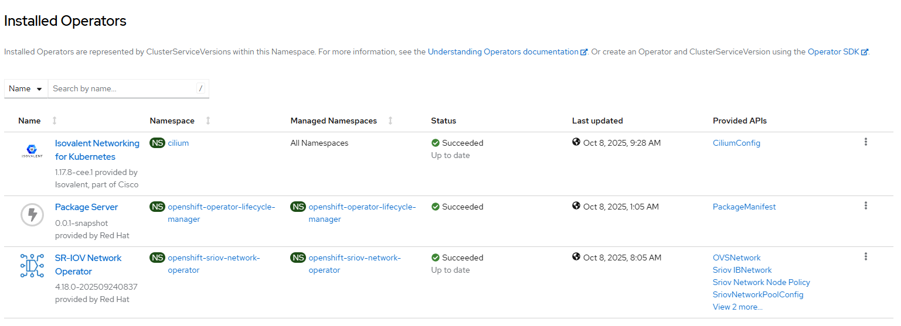
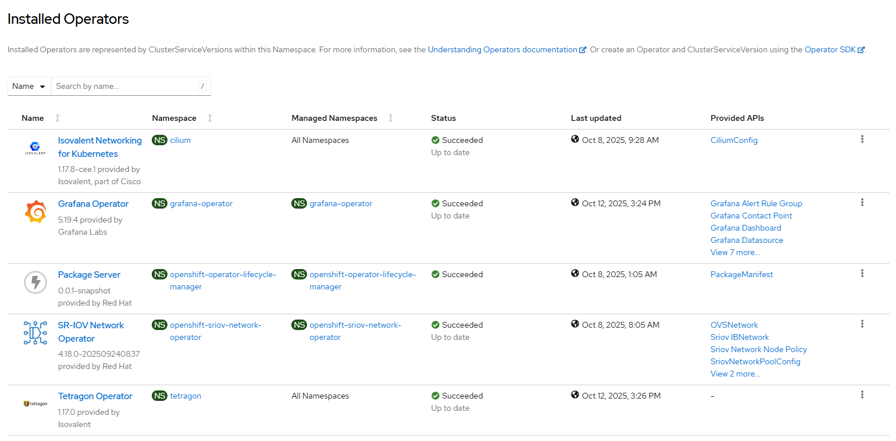
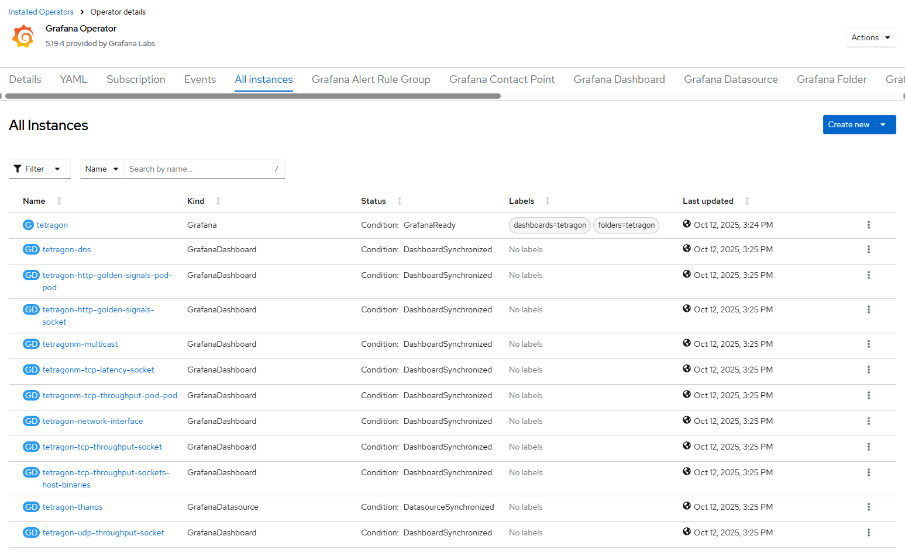
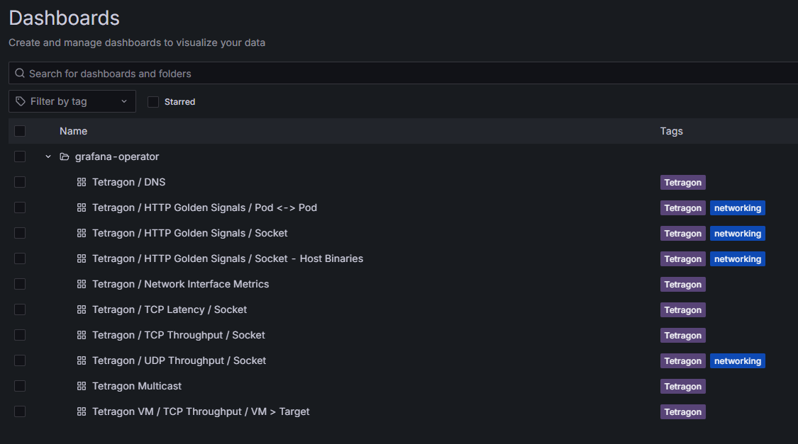
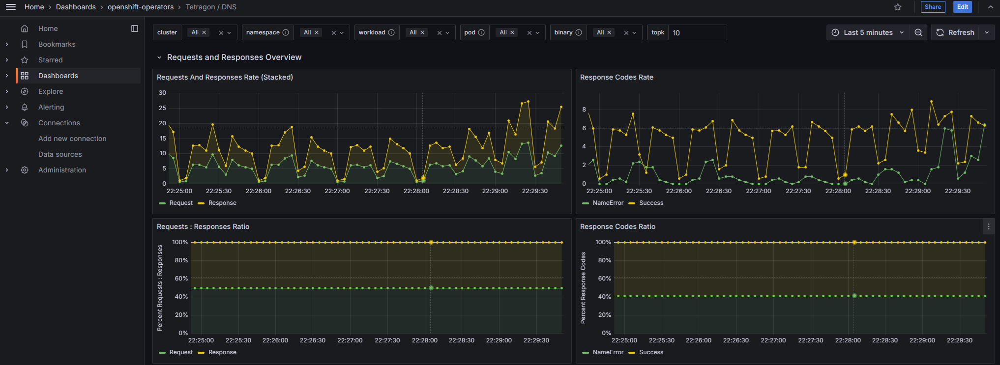

# Observability Dashboards

"Deeper Host Network Observability with eBPF" [blog](https://isovalent.com/blog/post/tetragon-network-observability-dashboards/) explains how Grafana dashboards can visualize Prometheus metrics exposed by Tetragon.

### Overview 

- get Tetragon policies and Grafana dashboards from Isovalent
- get Tetragon Enterprise operator image value from Isovalent
- prepare the task file that creates and configurs Grafana and Tetragon full stacks
- run it

### Step 1: Starting point

No pre-requsites. Grafana and Tetragon operator are not required as they will be created in the next step.



### Step 2: Task

Intent
- install Grafana operator with prometheus data source
- add dashboards with Tetragon metrics visualization
- add Tetragon Enterprise operator with prometheus metrics export and tracing policies

```
[
    {
        "grafana": {
            "operator": {},
            "mon": {},
            "instance": [
                {
                    "instance": "tetragon",
                    "username": "user",
                    "password": "pass",
                    "prometheus": true,
                    "datasource": "k8s",
                    "crd": [
                      "crd-filename-or-directory"
                    ],
                    "fixup": true
                }
            ]
        }
    },
    {
        "tetragon": {
            "operator": {
                "image": "image-name-as-provided-by-isovalent"
            },
            "prometheus": {},
            "wipe": {},
            "crd": {
                "crd": [
                  "crd-filename-or-directory"
                ]
            }
        }
    }
]
```

Run the tasks

```
# iserver set ocp task --filename absolute-task-filename --cluster cluster-name --no-confirm
```

See [here](./create_grafana.md) for output.

### Step 3: Outcome









### Step 4: Cleanup

If you want to cleanup the setup entirely run command below with exactly the same input file

```
# iserver delete ocp task --filename absolute-task-filename --cluster cluster-name --no-confirm
```

See [here](./delete_grafana.md) for output.

[[Back]](./README.md)