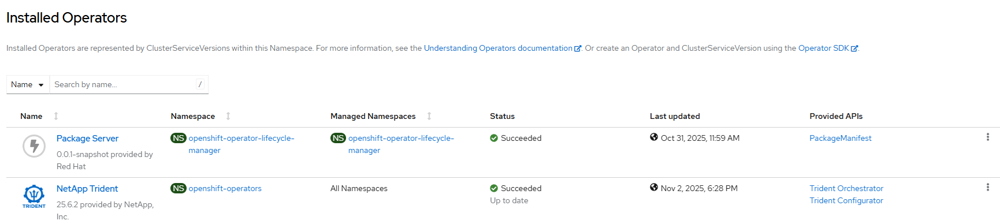

# Trident Operator - Create Operator

## Workflow

- create subscription with user controlled channel or defaultChannelName
- wait for resources ready

## Requirements

None

## Configurable options

```
# iserver set ocp trident --mode operator
  --cluster TEXT                  Cluster Name
  --channel TEXT                  Operator channel  [default: __default__]
  --no-confirm                    Confirmation mode
```

## Expected Outcome



## Example

```
# iserver set ocp trident --mode operator --no-confirm --cluster bm1


OpenShift Workflow - Trident Operator - Create Operator
=======================================================

Workflow Parameters
-------------------
{
    "cluster": "bm1",
    "channel": "__default__",
    "confirmation": true,
    "check-verbose": true,
    "namespace": "openshift-operators",
    "name": "trident-operator",
    "operator-group-name": "global-operators",
    "catalog": "certified-operators"
}


OpenShift Cluster
-----------------
- cluster: bm1 [domain:*****]
- api [*****]: ok
- dns resolution: ok


Create Subscription
-------------------
Subscription: openshift-operators/trident-operator
Source: openshift-marketplace/certified-operators/trident-operator
Install plan approval: Automatic
Getting subscription and packege manifest information...
Resolving channel name...
Channel: stable
- CSV [trident-operator.v25.6.2]
- CSV Display name [NetApp Trident]
- CVS Version [25.6.2]
- CSV Provider [{'name': 'NetApp, Inc.', 'url': 'https://www.netapp.com/'}]

~~~
apiVersion: operators.coreos.com/v1alpha1
kind: Subscription
metadata:
  name: trident-operator
  namespace: openshift-operators
spec:
  channel: stable
  installPlanApproval: Automatic
  name: trident-operator
  source: certified-operators
  sourceNamespace: openshift-marketplace

~~~

Subscription created

Wait for subscription install plan started [timeout:360]...
Install plan: install-h6g7s
Wait for subscription install plan ready [timeout:600]...
Install plan succeeded
Wait for deployments ready (optional: True, allow zero replicas: False)...
- openshift-operators/trident-operator

Completed tasks
- Trident Operator installed
```

[[Back]](./README.md)