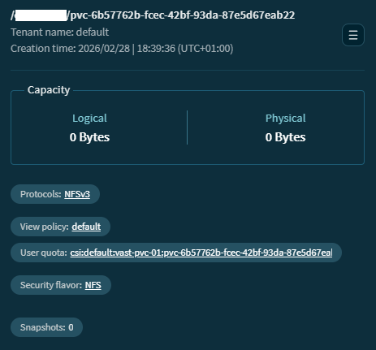

# VAST CSI operator configuration example

## Prerequisites

VAST CSI operator [installed](./create_operator.md), e.g.,

```
# iserver get ocp vast --cluster bm1

OpenShift Workflow - VAST CSI Operator - Get Information
========================================================

OpenShift Cluster: bm1

VAST CSI Operator Subscription
------------------------------
- subscription: vast-csi/vast-csi-operator
- package: vast-csi-operator
- csv: vast-csi-operator.v2.6.4

VAST CSI Operator Resources
---------------------------
- deployment vast-csi/vast-csi-operator-controller-manager ready
- 0 driver
- 0 cluster
- 0 storage
- 0 storage class
- 0 pvc
```

## Custom resource definitions

VAST CSI operator adds custom resources
- `VastCSIDriver`
- `VastCluster`
- `VastStorage`

All need to be defined to configure OpenShift cluster to use VAST as storage backend.

## VastCSIDriver

```
apiVersion: storage.vastdata.com/v1
kind: VastCSIDriver
metadata:
  name: vast-nfs
  namespace: vast-csi
spec:
  driverType: "nfs"
  image:
    csiVastPlugin:
      repository: docker.io/vastdataorg/csi:v2.6.4
```

## VastCluster

```
apiVersion: storage.vastdata.com/v1
kind: VastCluster
metadata:
  name: cluster
  namespace: vast-csi
spec:
  endpoint: vast-fqdn-or-ip
  username: admin
  password: "secret"
```

`Secret` object generated by operator based on `VastCluster`

```
apiVersion: v1
kind: Secret
metadata:
  annotations:
    meta.helm.sh/release-name: cluster
    meta.helm.sh/release-namespace: vast-csi
  labels:
    app.kubernetes.io/instance: cluster
    app.kubernetes.io/managed-by: Helm
    app.kubernetes.io/name: vastcluster
    helm.sh/chart: vastcluster-v2.6.4
    used-by: vast-csi-driver-operator
  name: cluster
  namespace: vast-csi
  ownerReferences:
  - apiVersion: storage.vastdata.com/v1
    blockOwnerDeletion: true
    controller: true
    kind: VastCluster
    name: cluster
type: Opaque
data:
  endpoint: ...
  password: ...
  username: ...
```

## VastStorage

```
apiVersion: storage.vastdata.com/v1
kind: VastStorage
metadata:
  name: vast-filesystem
  namespace: vast-csi
spec:
  driverType: "nfs"
  provisioner: "vast-nfs"
  secretName: cluster
  secretNamespace: vast-csi
  storagePath: "/mypath"
  viewPolicy: "default"
  vipPool: "vast-pool"
  allowVolumeExpansion: true
  createSnapshotClass: false
```

Note:
- spec.provisioner refers to `VastCSIDriver` CRD
- spec.storagePath must have matching `Element Store -> View` defintion
- spec.viewPolicy must have matching `Element Store -> View Policy` defintion
- spec.vipPool must have matching `Network Access -> Virtual IP Pools` defintion

## Storage Class

`StorageClass` generated by `VastStorage`

```
# oc get sc
NAME              PROVISIONER   RECLAIMPOLICY   VOLUMEBINDINGMODE   ALLOWVOLUMEEXPANSION   AGE
vast-filesystem   vast-nfs      Delete          Immediate           true                   12m
```

```
# oc get storageclasses.storage.k8s.io vast-filesystem -o yaml
apiVersion: storage.k8s.io/v1
kind: StorageClass
metadata:
  annotations:
    meta.helm.sh/release-name: vast-filesystem
    meta.helm.sh/release-namespace: vast-csi
    storageclass.kubernetes.io/is-default-class: "false"
  labels:
    app.kubernetes.io/instance: vast-filesystem
    app.kubernetes.io/managed-by: Helm
    app.kubernetes.io/name: vaststorage
    helm.sh/chart: vaststorage-v2.6.4
  name: vast-filesystem
parameters:
  csi.storage.k8s.io/controller-expand-secret-name: cluster
  csi.storage.k8s.io/controller-expand-secret-namespace: vast-csi
  csi.storage.k8s.io/controller-publish-secret-name: cluster
  csi.storage.k8s.io/controller-publish-secret-namespace: vast-csi
  csi.storage.k8s.io/node-expand-secret-name: cluster
  csi.storage.k8s.io/node-expand-secret-namespace: vast-csi
  csi.storage.k8s.io/node-publish-secret-name: cluster
  csi.storage.k8s.io/node-publish-secret-namespace: vast-csi
  csi.storage.k8s.io/node-stage-secret-name: cluster
  csi.storage.k8s.io/node-stage-secret-namespace: vast-csi
  csi.storage.k8s.io/provisioner-secret-name: cluster
  csi.storage.k8s.io/provisioner-secret-namespace: vast-csi
  eph_volume_name_fmt: csi:{namespace}:{name}:{id}
  root_export: /mypath
  view_policy: default
  vip_pool_fqdn_random_prefix: "true"
  vip_pool_name: vast-pool
  volume_name_fmt: csi:{namespace}:{name}:{id}
allowVolumeExpansion: true
provisioner: vast-nfs
reclaimPolicy: Delete
volumeBindingMode: Immediate
```

## PVC

```
apiVersion: v1
kind: PersistentVolumeClaim
metadata:
  name: vast-pvc-01
  namespace: default
spec:
  accessModes:
  - ReadWriteOnce
  resources:
    requests:
      storage: 1Gi
  storageClassName: vast-filesystem
```

```
# oc get pvc -n default
NAME          STATUS   VOLUME                                     CAPACITY   ACCESS MODES   STORAGECLASS      VOLUMEATTRIBUTESCLASS   AGE
vast-pvc-01   Bound    pvc-6b57762b-fcec-42bf-93da-87e5d67eab22   1Gi        RWO            vast-filesystem   <unset>                 11m
```



[[Back]](./README.md)