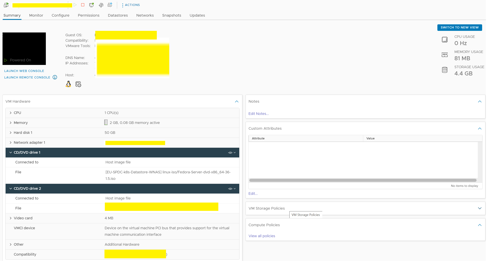
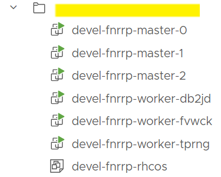
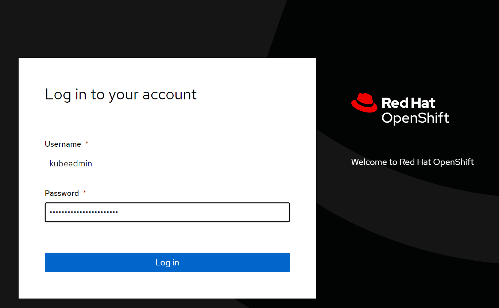
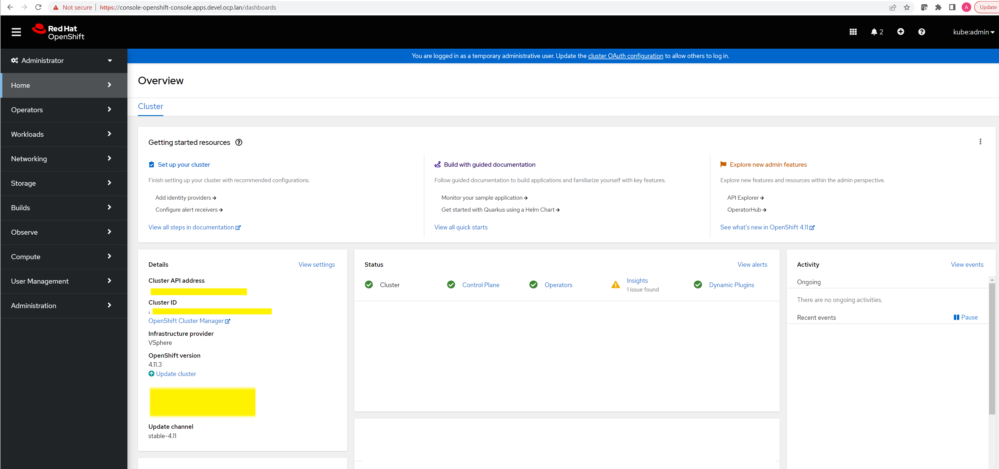

# OpenShift Container Platform (OCP)

## Create OCP Cluster in vCenter

Example:

```
# iserver create ocp cluster .\samples\ocp\cluster\vcenter\devel
```

where the directory must contain cluster definition and pull secret. That's all you need to do.

The rest of document explains what is happening once you execute the command and how cluster definition files are used.

Workflow follows [vsphere-ipi installation procedure](https://docs.openshift.com/container-platform/4.13/installing/installing_vsphere/installing-vsphere-installer-provisioned.html)

### Step 1: Create installer virtual machine

- create installer virtual machine in vcenter following the user-defined cluster settings

Example: vcenter settings

```
vcenter:
  name: <name>
  ip: <ip>
  port: 443
  username: ********
  password: ********
  datacenter: <dc>
  datastore: <datastore>
  cluster: <cluster>
  folder: <folder>
  network: <network>
```

Example: installer virtual machine settings

```
installer:
  ks:
    folder: <folder>
  iso:
    destination: <path>
  vm:
    name: <name>
    cpu: 1
    memory: 2048
    disk:
      size: 50
    ip: <ip>
    username: *****
    password: *****
```

- iso image can be pre-uploaded to vcenter and iso.destination defines the name of the iso file
- if iso.source is defined and iso.destination does not exist, workflow will upload local iso file to vcenter
- virtual machine is created from iso with generated kickstart file mounted as cdrom device
- workflow waits until ssh access to virtual machine.

Example: create workflow output

```
Input parameters verification...
vsphere-ipi ocp creation workflow...
Selecting the first available host: <host>
Virtual Machine created: <name>
Cdrom added to virtual machine
Cdrom added to virtual machine
The current powerState is: poweredOff
Virtual Machine powered on: <name>
Wait for SSH access with 3600 seconds timeout
```



### Step 2: Prepare installer virtual machine

The starting point of this step is fresh-installed Linux VM that needs to be further configured
- load necessary system packages
- prepare dhcpd configuration and start dhcpd
- prepare dns configuration and start named
- generate ssh key (ed25519) for cluster node SSH access

Note: dhcpd and named configuration files are generated based on user input

```
dns:
  managed: True
  forwarders: <dns>
```

```
dhcp:
  subnet: <network>
  gateway: <gateway>
  range: <start>-<stop>
  dns:
    servers: <dns>
    domain: domain.com
  ntp:
    servers: <ntp-ip>
    timezone: <tz>
```

```
ocp:
  name: <name>
  cluster:
    domain: <domain>
    api_vip: <api-vip>
    ingress_vip: <ingress-vip>
```

Generated /etc/dhcp/dhcpd.conf

```
authoritative;
ddns-update-style interim;
allow booting;
allow bootp;
allow unknown-clients;
ignore client-updates;
default-lease-time 14400;
max-lease-time 14400;

subnet <network> netmask <mask> {
    range                           <start> <stop>;
    option routers                  <gateway>;
    option subnet-mask              <mask>;
    option domain-name              "<domain>";
    option domain-name-servers      <local-dns-ip>;
    option ntp-servers              <ntp-ip>;
}
```

Generated /etc/named.conf

```
options {
    listen-on port 53 { 127.0.0.1; <local-dns-ip>; };
    directory       "/var/named";
    dump-file       "/var/named/data/cache_dump.db";
    statistics-file "/var/named/data/named_stats.txt";
    memstatistics-file "/var/named/data/named_mem_stats.txt";
    recursing-file  "/var/named/data/named.recursing";
    secroots-file   "/var/named/data/named.secroots";
    allow-query     { localhost; <network>; };
    recursion yes;

    dnssec-enable no;
    dnssec-validation no;

    # Using Google DNS
    forwarders {
        <dns>;
    };

    /* Path to ISC DLV key */
    bindkeys-file "/etc/named.root.key";

    managed-keys-directory "/var/named/dynamic";

    pid-file "/run/named/named.pid";
    session-keyfile "/run/named/session.key";
};

logging {
    channel default_debug {
            file "data/named.run";
            severity dynamic;
    };
};

zone "." IN {
    type hint;
    file "named.ca";
};

zone "<domain>" {
    type master;
    file "/etc/named/zones/db.<domain>";
};

zone "x.y.z.in-addr.arpa" {
    type master;
    file "/etc/named/zones/db.reverse";
};

include "/etc/named.rfc1912.zones";
include "/etc/named.root.key";
```

Generated  /etc/named/zones/db.domain
```
$TTL    604800
@       IN      SOA     <domain>. root.<domain> (
         2023071201     ; Serial
             604800     ; Refresh
              86400     ; Retry
            2419200     ; Expire
             604800     ; Minimum
)
                 NS     <domain>.

<domain>.         IN    A    <local-dns-ip>
api.devel.<domain>.        IN    A    <api-vip>
*.apps.devel.<domain>.     IN    A    <ingress-vip>
```

### Step 3: Prepare openshift installer binaries

- openshift installer downloaded from https://mirror.openshift.com/pub/openshift-v4/amd64/clients/ocp
- openshift release controller in user input
- oc binary downloaded from the same location

```
ocp:
  release: <version>
  source: web
```

- upload tarballs to installer virtual machine
- unpack
- move oc to /usr/local/bin

```
[root@<name> ~]# ls /usr/local/bin/
kubectl  oc
```

### Step 4: Prepare config.yaml

- OCP configuration yaml file generated based on user input.

```
ocp:
  name: <name>
  installation: vsphere-ipi
  release: <version>
  source: web
  cluster:
    name: devel
    domain: <domain>
    api_vip: <api-vip>
    ingress_vip: <ingress-vip>
    master:
      hyperthreading: True
      replicas: 3
      cpu: 4
      memory: 16384
      disk:
        size: 120
    worker:
      hyperthreading: True
      replicas: 3
      cpu: 4
      memory: 8192
      disk:
        size: 120
```

- with optional http proxy settings

```
proxy:
  enabled: True
  http: http://proxy.domain.com:80
  https: http://proxy.domain.com:80
```

- with optional additional ssh key

```
ssh:
  - 'ssh-ed25519 AAAA... user@host'
```

- embed user provided pull-secret into configuration yaml
- follow user provided cni settings

Example: OpenShiftSDN

```
cni:
  type: OpenShiftSDN
  v4cidr: 10.128.0.0/14
  v4hostPrefix: 23
  v4serviceNetwork: 172.30.0.0/16
```

Example: Calico with BGP settings

```
cni:
  type: Calico
  v4cidr: 10.128.0.0/14
  v4hostPrefix: 23
  v4serviceNetwork: 172.30.0.0/16

bgp:
  local_as: <my-asn>
  remote_as: <remote-asn>
  peer:
  - <peer1>
  - <peer2>
  mesh: true
  external_ips:
  - x.y.z.0/24
  - x.y.z.66/32,1:128
  - x.y.z.67/32,1:128
```

Example: generated config.yaml

```
apiVersion: v1
baseDomain: <domain>
proxy:
  httpProxy: http://proxy.domain.com:80
  httpsProxy: http://proxy.domain.com:80
  noProxy: localhost,.<domain>,<vcenter>,<host1>,<host2>,<local-dns-ip>,<api-vip>,<ingress-vip>,<all-ips>
compute:
- hyperthreading: Enabled
  name: worker
  replicas: 3
  platform:
    vsphere:
      cpus: 4
      coresPerSocket: 2
      memoryMB: 8192
      osDisk:
        diskSizeGB: 120
controlPlane:
  hyperthreading: Enabled
  name: master
  replicas: 3
  platform:
    vsphere:
      cpus: 4
      coresPerSocket: 2
      memoryMB: 16384
      osDisk:
        diskSizeGB: 120
metadata:
  name: devel
networking:
  clusterNetwork:
  - cidr: 10.128.0.0/14
    hostPrefix: 23
  machineNetwork:
  - cidr: <network>
  networkType: OpenShiftSDN
  serviceNetwork:
  - 172.30.0.0/16
platform:
  vsphere:
    vcenter: <vcenter>
    username: ********
    password: "********"
    datacenter: <dc>
    defaultDatastore: <datastore>
    folder: <folder>
    diskType: thin
    network: <network>
    cluster: <cluster>
    apiVIP: <api-vip>
    ingressVIP: <ingress-vip>
fips: false
pullSecret: '{"auths":{"cloud.openshift.com":{"auth":"...","email":"user@domain.com"}}}'
sshKey: 'ssh-ed25519 AAAA... root@<name>'
```
### Step 5: Calico CNI

If Calico CNI is defined:
- download calico manifests from https://docs.projectcalico.org/archive/v${CALICO_VERSION}/manifests
- download calicoctl
- optionally prepare bgp.yaml configuration

Version and calicoctl is user-controlled and follows the default settings i.e.

```
calico:
  version: 3.20
  calicoctl: https://github.com/projectcalico/calicoctl/releases/download/v3.20.6/calicoctl-linux-amd64
```

Optional http proxy settings are used during download.

### Step 6: Add vCenter root CA certificates to your system trust

- download certification bundle from vcenter
- unzip
- copy relevant files to /etc/pki/ca-trust/source/anchors
- update CA trust settings

### Step 7: Run openshift-install

- execute openshift-install command on the installer virtual machine using generated config.yaml
- wait until installer finishes

```
DEBUG Cluster is initialized
INFO Waiting up to 10m0s (until 9:09PM) for the openshift-console route to be created...
DEBUG Route found in openshift-console namespace: console
DEBUG OpenShift console route is admitted
INFO Install complete!
INFO To access the cluster as the system:admin user when using 'oc', run
INFO     export KUBECONFIG=/root/install/auth/kubeconfig
INFO Access the OpenShift web-console here: https://console-openshift-console.apps.devel.<domain>
INFO Login to the console with user: "kubeadmin", and password: "********"
DEBUG Time elapsed per stage:
DEBUG      pre-bootstrap: 38s
DEBUG          bootstrap: 31s
DEBUG             master: 56s
DEBUG Bootstrap Complete: 17m29s
DEBUG                API: 1m59s
DEBUG  Bootstrap Destroy: 40s
DEBUG  Cluster Operators: 13m23s
DEBUG            Console: 1s
INFO Time elapsed: 35m41s
```

### Step 8: Prepare kubeconfig

- prepare kubeconfig binary in /usr/local/bin
- make sure KUBECONFIG env variable is configured upon ssh login (/root/.bashrc)

```
[root@<name> ~]# kubectl get ns
NAME                                               STATUS   AGE
default                                            Active   56m
kube-node-lease                                    Active   56m
kube-public                                        Active   56m
kube-system                                        Active   56m
openshift                                          Active   44m
...
```

### Step 9: Check OCP state

- execute script that checks OCP cluster state using kubectl command
- expected state is that all nodes are in Ready state

```
NAME                    STATUS   ROLES    AGE     VERSION
<vm-base>master-0       Ready    master   24m     v1.24.0+b62823b
<vm-base>master-1       Ready    master   24m     v1.24.0+b62823b
<vm-base>master-2       Ready    master   24m     v1.24.0+b62823b
<vm-base>worker-db2jd   Ready    worker   9m21s   v1.24.0+b62823b
<vm-base>worker-fvwck   Ready    worker   9m13s   v1.24.0+b62823b
<vm-base>worker-tprng   Ready    worker   9m15s   v1.24.0+b62823b
```



### Step 10: iserver tasks

- copy kubeconfig
- copy kubeadmin
- create ocp cluster settings

```
# iserver get ocp cluster --cluster <name> --view kc --verify
|
+--------+-------------+-----------+--------------+------------+--------------------+--------------+--------------+---------+
| Name   | Type        | Release   | CNI          | Kubeconfig | API FQDN           | API VIP      | API DNS      | K8s API |
+------------------+---------------+--------------+--------------+------------------+--------------+--------------+---------+
| <name> | vsphere-ipi | <version> | OpenShiftSDN | ✓          | api.devel.<domain> | <api-vip>    | <api-vip>    | ✓      |
+------------------+---------------+--------------+------------+--------------------+--------------+--------------+---------+
```

```
# iserver get ocp cluster --cluster <name> --view console
|
+--------+-------------------------------------------------------+----------------------+-----------------+-------------------------------------+----------------------+-----------------+-----------+-------------------------+
| Name   | Console URL                                           | Expected Resolved IP | DNS Resolved IP | Authentication FQDN                 | Expected Resolved IP | DNS Resolved IP | Username  | Password                |
+--------+-------------------------------------------------------+----------------------+-----------------+-------------------------------------+----------------------+-----------------+-----------+-------------------------+
| <name> | https://console-openshift-console.apps.devel.<domain> | <ingress-vip>        | <ingress-vip>   | oauth-openshift.apps.devel.<domain> | <ingress-vip>        | <ingress-vip>   | kubeadmin | ********                |
+--------+-------------------------------------------------------+----------------------+-----------------+-------------------------------------+----------------------+-----------------+-----------+-------------------------+
```

Note:
- depending on the dns setup, you may need to configure local dns resolution

Example: /etc/hosts

```
<api-vip>	api.devel.<domain>
<ingress-vip>    oauth-openshift.apps.devel.<domain>
<ingress-vip>    console-openshift-console.apps.devel.<domain>
```





[[Back]](../VcenterCluster.md)