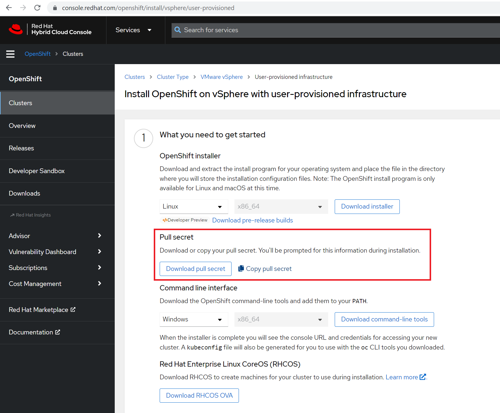

# OpenShift Container Platform (OCP)

## Device OCP Cluster for vCenter deployment

- Cluster definition is in yaml files that have to be in the same directory
- Single file with all sections supported
- If multiple files are used, keep section to single file

### vCenter

Requirements:
- single vcenter
- datacenter, datastore, folder and network must exist
- host_ip optional

```
vcenter:
  name: <name>
  ip: <ip>
  port: 443
  username: ********
  password: ********
  datacenter: <datacenter>
  datastore: <datastore>
  cluster: <cluster>
  folder: <folder>
  host_ip: <host>
  network: <network>
```

### Installer virtual machine

- Installer virtual machine created from iso
- kickstart file generated based on user input
- Fedora recommended/supported
- ISO can be uploaded manually to datastore (skip iso.source in such case)

```
installer:
  ks:
    folder: <folder>
    overwrite: False
  iso:
    source: <path>
    destination: <path>
  vm:
    name: <name>
    cpu: 1
    memory: 2048
    disk:
      size: 50
    ip: <ip>
    username: *****
    password: *****
```

### OCP Main Settings

- ocp.release defines the desired OCP distribution available at public [repository](https://mirror.openshift.com/pub/openshift-v4/amd64/clients/ocp)

```
ocp:
  name: <name>
  installation: vsphere-ipi
  release: <version>
  source: web
  cluster:
    name: <name>
    domain: <domain>
    api_vip: <ip>
    ingress_vip: <ip>
    master:
      hyperthreading: True
      replicas: 3
      cpu: 4
      memory: 16384
      disk:
        size: 120
    worker:
      hyperthreading: True
      replicas: 3
      cpu: 4
      memory: 8192
      disk:
        size: 120
```

### HTTP Proxy

- optional
- if defined, proxy settings are used at installer virtual machine and OCP cluster definition yaml

```
proxy:
  enabled: True
  http: http://proxy.domain.com:80
  https: http://proxy.domain.com:80
  no_proxy: .domain.com
```

### SSH Keys

- optional
- if defined, extra ssh keys are added to OCP cluster definition yaml
- multiple keys supported
- this way you can ssh-access the clusted nodes from other hosts
- otherwise, cluster nodes can be only accessed from the installer virtual machine

```
ssh:
  - 'ssh-ed25519 AAAA.. user@host'
  - 'ssh-ed25519 AAAA.. user@host'
```

### Linux Jump Host

- optional
- generation of kickstart iso image requires genisoimage application
- if it is available on the host where iserver runs then no need to define jump host
- otherwise define the jump host where genisoimage is available

```
jump:
  ip: <ip>
  username: *****
  password: *****
```

### DNS Settings

- named is installed on installer virtual machine (dns.managed: True)
- this DNS server will be configured on all cluster nodes via OCP configuration yaml setting
- dns.forwarders will be configured in named
- it is mandatory to provide proper dns forwarder as OCP installation is pulling binaries from internet

```
dns:
  managed: True
  forwarders: <ip>>
```

### DHCP Settings

- dhcpd is installed on the installer virtual machine
- all cluster nodes are configured with dhcp client and will get IP address from this dhcp server
- make sure to define range for master and worker nodes as well as ephemeral bootstrap virtual machine created by OCP cluster installer

```
dhcp:
  subnet: <subnet>
  gateway: <gateway>
  range: <start>-<end>
  dns:
    servers: <ip>
    domain: domain.com
  ntp:
    servers: <ip>
    timezone: <tz>
```

### CNI

- the minimum mandatory CNI section must contain cni.type with OpenShiftSDN, OVNKubernetes, or Calico value

```
cni:
    type: OpenShiftSDN
```

- POD and Service CIDR as well as host prefix can be customized from default values

```
cni:
  type: OpenShiftSDN
  v4cidr: 10.128.0.0/14
  v4hostPrefix: 23
  v4serviceNetwork: 172.30.0.0/16
```

- in case of Calico, bgp settings can be defined

```
bgp:
  local_as: <my-ans>
  remote_as: <remote-asn>
  peer:
  - <peer1>
  - <peer2>
  mesh: true
  external_ips:
  - x.y.z.0/24
  - x.y.z.66/32,1:128
  - x.y.z.67/32,1:128
```

### Pull secret

- access console.redhat.com
- navigate to create new cluster, datacenter, vSphere
- download pull secret
- save it to ./secret/pull-secret.txt in the directory where yaml files are



[[Back]](../VcenterCluster.md)