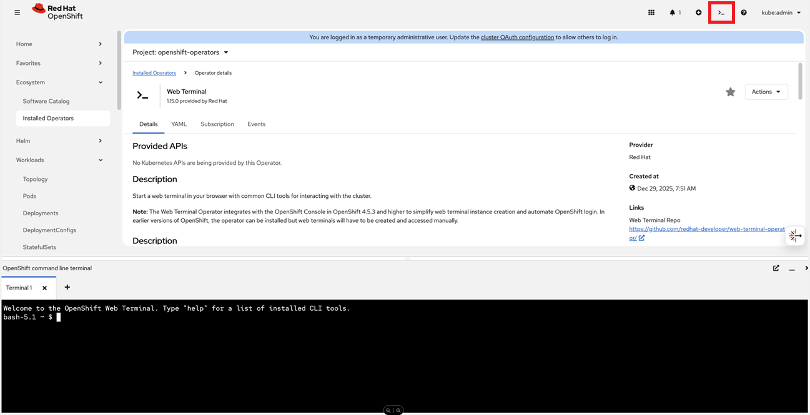

# Web Terminal Operator

Allows starting web terminal in browser when logged in Console UI

Command | Intent | Details
--- | --- | ---
iserver get ocp cli-web | get web terminal cli operator | [Link](./get.md)
iserver set ocp cli-web | add web terminal cli operator | [Link](./set.md)
iserver delete ocp cli-web | delete web terminal cli operator | [Link](./delete.md)
iserver set ocp task | in task way | [Link](./create_task.md)

[[Back]](../Operations.md)