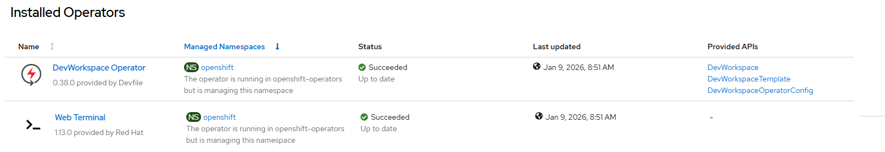

# CLI Web Terminal - Create Operator

## Workflow

- create subscription with user controlled channel or defaultChannelName
- wait for resources ready 

## Requirements

None

## Expected outcome



## Configurable options

```
# iserver set ocp cnv --mode operator
  --cluster TEXT                  Cluster Name
  --channel TEXT                  Operator channel  [default: __default__]
  --no-confirm                    Confirmation mode
```

## Example

```
# iserver set ocp cli-web --cluster bm1

OpenShift Workflow - Web Terminal Operator - Create Operator
============================================================

OpenShift Cluster: bm1

Create Subscription
-------------------
Subscription: openshift-operators/web-terminal
Source: openshift-marketplace/redhat-operators/web-terminal
Install plan approval: Automatic
Getting subscription and packege manifest information...
Resolving channel name...
Channel: fast
- CSV [web-terminal.v1.13.0]
- CSV Display name [Web Terminal]
- CVS Version [1.13.0]
- CSV Provider [{'name': 'Red Hat'}]
- CSV Maturity [alpha]

~~~
apiVersion: operators.coreos.com/v1alpha1
kind: Subscription
metadata:
  name: web-terminal
  namespace: openshift-operators
spec:
  channel: fast
  installPlanApproval: Automatic
  name: web-terminal
  source: redhat-operators
  sourceNamespace: openshift-marketplace

~~~
Continue [Y/N]? y

Subscription created

Wait for subscription install plan started [timeout:360]...
Install plan: install-5prw5
Wait for subscription install plan ready [timeout:600]...
Install plan succeeded
Wait for deployments ready (optional: True, allow zero replicas: False)...
- openshift-operators/web-terminal-controller
- openshift-operators/devworkspace-controller-manager
- openshift-operators/devworkspace-webhook-server

Completed tasks
- Web terminal operator installed
```

[[Back]](./README.md)