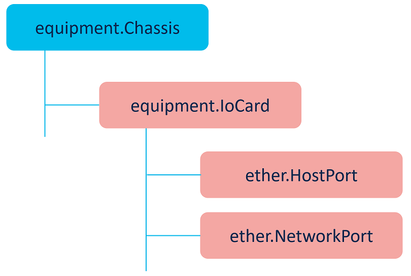

# UCSX-9508 IFM monitoring with Intersight API



## equipment.Chassis

Intersight API object relationships:
- reference to IFM I/O modules via Ioms[]

```
isctl get equipment chassis moid 632b13c876752d32362fc175

{
    "AccountMoid": "5a58c3ba3768393836cb0f1b",
    "AlarmSummary": {
        "ClassId": "compute.AlarmSummary",
        "Critical": 0,
        "ObjectType": "compute.AlarmSummary",
        "Warning": 2
    },
    "Ancestors": [],
    "Blades": [
        {
            "ClassId": "mo.MoRef",
            "Moid": "632b163d76752d323630734f",
            "ObjectType": "compute.Blade",
            "link": "https://www.intersight.com/api/v1/compute/Blades/632b163d76752d323630734f"
        },
        {
            "ClassId": "mo.MoRef",
            "Moid": "632b163e76752d32363073aa",
            "ObjectType": "compute.Blade",
            "link": "https://www.intersight.com/api/v1/compute/Blades/632b163e76752d32363073aa"
        },
        {
            "ClassId": "mo.MoRef",
            "Moid": "632b163f76752d32363073f7",
            "ObjectType": "compute.Blade",
            "link": "https://www.intersight.com/api/v1/compute/Blades/632b163f76752d32363073f7"
        },
        {
            "ClassId": "mo.MoRef",
            "Moid": "632b174e76752d323630bb47",
            "ObjectType": "compute.Blade",
            "link": "https://www.intersight.com/api/v1/compute/Blades/632b174e76752d323630bb47"
        }
    ],
    "ChassisId": 1,
    "ClassId": "equipment.Chassis",
    "ConnectionPath": "A,B",
    "ConnectionStatus": "A,B",
    "CreateTime": "2022-09-21T13:38:16.386Z",
    "Description": "Cisco Blade Server Chassis, 7U with Eight Vertical Blade Server Slots",
    "DeviceMoId": "632999466f72612d39b26942",
    "Dn": "chassis-1",
    "DomainGroupMoid": "5b2541957a7662743465d06d",
    "ExpanderModules": [
        {
            "ClassId": "mo.MoRef",
            "Moid": "632b15b476752d3236304c5c",
            "ObjectType": "equipment.ExpanderModule",
            "link": "https://www.intersight.com/api/v1/equipment/ExpanderModules/632b15b476752d3236304c5c"
        },
        {
            "ClassId": "mo.MoRef",
            "Moid": "632b15b476752d3236304c69",
            "ObjectType": "equipment.ExpanderModule",
            "link": "https://www.intersight.com/api/v1/equipment/ExpanderModules/632b15b476752d3236304c69"
        }
    ],
    "FanControl": {
        "ClassId": "mo.MoRef",
        "Moid": "632b15b476752d3236304c55",
        "ObjectType": "equipment.FanControl",
        "link": "https://www.intersight.com/api/v1/equipment/FanControls/632b15b476752d3236304c55"
    },
    "Fanmodules": [
        {
            "ClassId": "mo.MoRef",
            "Moid": "632b15b576752d3236304cf8",
            "ObjectType": "equipment.FanModule",
            "link": "https://www.intersight.com/api/v1/equipment/FanModules/632b15b576752d3236304cf8"
        },
        {
            "ClassId": "mo.MoRef",
            "Moid": "632b15b576752d3236304d08",
            "ObjectType": "equipment.FanModule",
            "link": "https://www.intersight.com/api/v1/equipment/FanModules/632b15b576752d3236304d08"
        },
        {
            "ClassId": "mo.MoRef",
            "Moid": "632b15b576752d3236304d17",
            "ObjectType": "equipment.FanModule",
            "link": "https://www.intersight.com/api/v1/equipment/FanModules/632b15b576752d3236304d17"
        },
        {
            "ClassId": "mo.MoRef",
            "Moid": "632b15b576752d3236304d27",
            "ObjectType": "equipment.FanModule",
            "link": "https://www.intersight.com/api/v1/equipment/FanModules/632b15b576752d3236304d27"
        }
    ],
    "FaultSummary": 0,
    "InventoryDeviceInfo": null,
    "Ioms": [
        {
            "ClassId": "mo.MoRef",
            "Moid": "632b13c876752d32362fc17c",
            "ObjectType": "equipment.IoCard",
            "link": "https://www.intersight.com/api/v1/equipment/IoCards/632b13c876752d32362fc17c"
        },
        {
            "ClassId": "mo.MoRef",
            "Moid": "632b13c976752d32362fc244",
            "ObjectType": "equipment.IoCard",
            "link": "https://www.intersight.com/api/v1/equipment/IoCards/632b13c976752d32362fc244"
        }
    ],
    "LocatorLed": {
        "ClassId": "mo.MoRef",
        "Moid": "632b15b476752d3236304c65",
        "ObjectType": "equipment.LocatorLed",
        "link": "https://www.intersight.com/api/v1/equipment/LocatorLeds/632b15b476752d3236304c65"
    },
    "ManagementInterface": null,
    "ManagementMode": "Intersight",
    "ModTime": "2022-10-14T10:35:56.04Z",
    "Model": "UCSX-9508",
    "Moid": "632b13c876752d32362fc175",
    "Name": "ucsX-1",
    "ObjectType": "equipment.Chassis",
    "OperReason": [],
    "OperState": "OK",
    "Owners": [
        "5a58c3ba3768393836cb0f1b",
        "632999466f72612d39b26942"
    ],
    "PartNumber": "68-6847-03  ",
    "PermissionResources": [
        {
            "ClassId": "mo.MoRef",
            "Moid": "5ddee0c26972652d33555a3b",
            "ObjectType": "organization.Organization",
            "link": "https://www.intersight.com/api/v1/organization/Organizations/5ddee0c26972652d33555a3b"
        },
        {
            "ClassId": "mo.MoRef",
            "Moid": "63493b8a6972652d33272ab6",
            "ObjectType": "organization.Organization",
            "link": "https://www.intersight.com/api/v1/organization/Organizations/63493b8a6972652d33272ab6"
        }
    ],
    "Pid": "UCSX-9508",
    "PlatformType": "",
    "PowerControlState": {
        "ClassId": "mo.MoRef",
        "Moid": "632b15b576752d3236304cf0",
        "ObjectType": "power.ControlState",
        "link": "https://www.intersight.com/api/v1/power/ControlStates/632b15b576752d3236304cf0"
    },
    "Presence": "",
    "PreviousFru": null,
    "ProductName": "Cisco UCSX 9508 Chassis",
    "PsuControl": {
        "ClassId": "mo.MoRef",
        "Moid": "632b15b576752d3236304ceb",
        "ObjectType": "equipment.PsuControl",
        "link": "https://www.intersight.com/api/v1/equipment/PsuControls/632b15b576752d3236304ceb"
    },
    "Psus": [
        {
            "ClassId": "mo.MoRef",
            "Moid": "632b15b576752d3236304ccd",
            "ObjectType": "equipment.Psu",
            "link": "https://www.intersight.com/api/v1/equipment/Psus/632b15b576752d3236304ccd"
        },
        {
            "ClassId": "mo.MoRef",
            "Moid": "632b15b576752d3236304cd4",
            "ObjectType": "equipment.Psu",
            "link": "https://www.intersight.com/api/v1/equipment/Psus/632b15b576752d3236304cd4"
        },
        {
            "ClassId": "mo.MoRef",
            "Moid": "632b15b576752d3236304cd8",
            "ObjectType": "equipment.Psu",
            "link": "https://www.intersight.com/api/v1/equipment/Psus/632b15b576752d3236304cd8"
        },
        {
            "ClassId": "mo.MoRef",
            "Moid": "632b15b576752d3236304cdd",
            "ObjectType": "equipment.Psu",
            "link": "https://www.intersight.com/api/v1/equipment/Psus/632b15b576752d3236304cdd"
        },
        {
            "ClassId": "mo.MoRef",
            "Moid": "632b15b576752d3236304ce1",
            "ObjectType": "equipment.Psu",
            "link": "https://www.intersight.com/api/v1/equipment/Psus/632b15b576752d3236304ce1"
        },
        {
            "ClassId": "mo.MoRef",
            "Moid": "632b15b576752d3236304ce5",
            "ObjectType": "equipment.Psu",
            "link": "https://www.intersight.com/api/v1/equipment/Psus/632b15b576752d3236304ce5"
        }
    ],
    "RegisteredDevice": {
        "Account": {
            "ClassId": "mo.MoRef",
            "Moid": "5a58c3ba3768393836cb0f1b",
            "ObjectType": "iam.Account",
            "link": "https://www.intersight.com/api/v1/iam/Accounts/5a58c3ba3768393836cb0f1b"
        },
        "AccountMoid": "5a58c3ba3768393836cb0f1b",
        "Ancestors": [],
        "ApiVersion": 11,
        "AppPartitionNumber": 125,
        "ClaimedByUser": {
            "ClassId": "mo.MoRef",
            "Moid": "5a58c41a3768393836cb10bc",
            "ObjectType": "iam.User",
            "link": "https://www.intersight.com/api/v1/iam/Users/5a58c41a3768393836cb10bc"
        },
        "ClaimedByUserName": "sesousa@cisco.com",
        "ClaimedTime": "2022-09-20T10:43:18.327Z",
        "ClassId": "asset.DeviceRegistration",
        "ClusterMembers": [
            {
                "ClassId": "mo.MoRef",
                "Moid": "632999466f72612d39b26945",
                "ObjectType": "asset.ClusterMember",
                "link": "https://www.intersight.com/api/v1/asset/ClusterMembers/632999466f72612d39b26945"
            },
            {
                "ClassId": "mo.MoRef",
                "Moid": "632999466f72612d39b26946",
                "ObjectType": "asset.ClusterMember",
                "link": "https://www.intersight.com/api/v1/asset/ClusterMembers/632999466f72612d39b26946"
            }
        ],
        "ConnectionId": "e53fb7c94631f12a96832ed63dcdb8d4:8e008439-dc1d-4f25-89b9-8471e6262801",
        "ConnectionReason": "",
        "ConnectionStatus": "Connected",
        "ConnectionStatusLastChangeTime": "2022-11-13T03:27:22.596Z",
        "ConnectorVersion": "1.0.11-2396",
        "CreateTime": "2022-09-20T10:43:18.301Z",
        "DeviceClaim": {
            "ClassId": "mo.MoRef",
            "Moid": "632999466f72612d39b26939",
            "ObjectType": "asset.DeviceClaim",
            "link": "https://www.intersight.com/api/v1/asset/DeviceClaims/632999466f72612d39b26939"
        },
        "DeviceConfiguration": {
            "ClassId": "mo.MoRef",
            "Moid": "632999466f72612d39b26943",
            "ObjectType": "asset.DeviceConfiguration",
            "link": "https://www.intersight.com/api/v1/asset/DeviceConfigurations/632999466f72612d39b26943"
        },
        "DeviceExternalIpAddress": "62.28.62.162",
        "DeviceHostname": [
            "ucsX"
        ],
        "DeviceIpAddress": [
            "10.90.90.13",
            "10.90.90.14"
        ],
        "DomainGroup": {
            "ClassId": "mo.MoRef",
            "Moid": "5b2541957a7662743465d06d",
            "ObjectType": "iam.DomainGroup",
            "link": "https://www.intersight.com/api/v1/iam/DomainGroups/5b2541957a7662743465d06d"
        },
        "DomainGroupMoid": "5b2541957a7662743465d06d",
        "ExecutionMode": "Normal",
        "ModTime": "2022-11-13T03:27:22.648Z",
        "Moid": "632999466f72612d39b26942",
        "ObjectType": "asset.DeviceRegistration",
        "Owners": [
            "5a58c3ba3768393836cb0f1b",
            "632999466f72612d39b26942"
        ],
        "ParentConnection": null,
        "ParentSignature": null,
        "PermissionResources": [
            {
                "ClassId": "mo.MoRef",
                "Moid": "5ddee0c26972652d33555a3b",
                "ObjectType": "organization.Organization",
                "link": "https://www.intersight.com/api/v1/organization/Organizations/5ddee0c26972652d33555a3b"
            },
            {
                "ClassId": "mo.MoRef",
                "Moid": "63493b8a6972652d33272ab6",
                "ObjectType": "organization.Organization",
                "link": "https://www.intersight.com/api/v1/organization/Organizations/63493b8a6972652d33272ab6"
            }
        ],
        "Pid": [
            "UCS-FI-6454"
        ],
        "PlatformType": "UCSFIISM",
        "ProxyApp": "astro",
        "PublicAccessKey": "-----BEGIN RSA PUBLIC KEY-----\nMIIBIjANBgkqhkiG9w0BAQEFAAOCAQ8AMIIBCgKCAQEAu/kLAlQkjn2D6AB/BiHK\n995WhFbn7Ab+t9iEW8dZm3iC/ZiG9t5FTl3N8XImac43k8VCRl31HYsCTkx/DOwG\nnFfkUsjWZ0gdILkml911anN6Y/5ziMLDclX+E+kLhFF7ZnauHPY7/Q22w6/grvUh\nnqeEGhADBu9cBf+JtMOX0qYiHbs7n5oOykx0aCPknDaWXPjSq4YJfXw2KNqAIuXa\nCiGpzX7Zvapzln9w1zMpn+t82+hwuSiw6gI6idn5gYBCXoUdADtm0rO5+h7MmzS4\nPJnVyFPFLha0Fb458xm3XEKyGgQOAirgRmiJUL2vTu7pLsCJg9JA5RVyme3XqbBJ\n1QIDAQAB\n-----END RSA PUBLIC KEY-----\n",
        "ReadOnly": false,
        "SecurityToken": null,
        "Serial": [
            "FDO26340DE3",
            "FDO26340CVC"
        ],
        "SharedScope": "",
        "Tags": [
            {
                "Key": "cisco.meta.ManagementMode",
                "Value": "Intersight"
            }
        ],
        "Vendor": "Cisco Systems, Inc."
    },
    "Revision": "0",
    "Rn": "",
    "Sasexpanders": [],
    "Serial": "FOX2611PPHP",
    "SharedScope": "",
    "Siocs": [],
    "Sku": "UCSX-9508",
    "StorageEnclosures": [],
    "Tags": [],
    "Vendor": "Cisco Systems Inc",
    "Vid": "V01",
    "VirtualDriveContainer": []
}
```

## equipment.IoCard

Intersight API object relationships:
- reference to equipment.Chassis via Parent/Moid
- reference to host ports via HostPorts[]
- reference to network ports via NetworkPorts[]

```
isctl get equipment iocard --filter "Parent/Moid eq '632b13c876752d32362fc175'"  -o json --top 100

[
    {
        "AccountMoid": "5a58c3ba3768393836cb0f1b",
        "Ancestors": [
            {
                "ClassId": "mo.MoRef",
                "Moid": "632b13c876752d32362fc175",
                "ObjectType": "equipment.Chassis",
                "link": "https://www.intersight.com/api/v1/equipment/Chasses/632b13c876752d32362fc175"
            }
        ],
        "ClassId": "equipment.IoCard",
        "ConnectionPath": "A",
        "ConnectionStatus": "A",
        "CreateTime": "2022-09-21T13:38:16.424Z",
        "DcSupported": true,
        "Description": "Cisco UCS 9108-25G 8 Port IFM",
        "DeviceMoId": "632999466f72612d39b26942",
        "Dn": "chassis-1-ioc-2",
        "DomainGroupMoid": "5b2541957a7662743465d06d",
        "EquipmentChassis": {
            "ClassId": "mo.MoRef",
            "Moid": "632b13c876752d32362fc175",
            "ObjectType": "equipment.Chassis",
            "link": "https://www.intersight.com/api/v1/equipment/Chasses/632b13c876752d32362fc175"
        },
        "EquipmentFex": null,
        "FanModules": [
            {
                "ClassId": "mo.MoRef",
                "Moid": "632b15b576752d3236304d3d",
                "ObjectType": "equipment.FanModule",
                "link": "https://www.intersight.com/api/v1/equipment/FanModules/632b15b576752d3236304d3d"
            },
            {
                "ClassId": "mo.MoRef",
                "Moid": "632b15b576752d3236304d58",
                "ObjectType": "equipment.FanModule",
                "link": "https://www.intersight.com/api/v1/equipment/FanModules/632b15b576752d3236304d58"
            },
            {
                "ClassId": "mo.MoRef",
                "Moid": "632b15b576752d3236304d6f",
                "ObjectType": "equipment.FanModule",
                "link": "https://www.intersight.com/api/v1/equipment/FanModules/632b15b576752d3236304d6f"
            }
        ],
        "HostPorts": [
            {
                "ClassId": "mo.MoRef",
                "Moid": "632b158c6373582d415a5ad6",
                "ObjectType": "ether.HostPort",
                "link": "https://www.intersight.com/api/v1/ether/HostPorts/632b158c6373582d415a5ad6"
            },
            {
                "ClassId": "mo.MoRef",
                "Moid": "632b158c6373582d415a5ac0",
                "ObjectType": "ether.HostPort",
                "link": "https://www.intersight.com/api/v1/ether/HostPorts/632b158c6373582d415a5ac0"
            },
            {
                "ClassId": "mo.MoRef",
                "Moid": "632b158c6373582d415a5acc",
                "ObjectType": "ether.HostPort",
                "link": "https://www.intersight.com/api/v1/ether/HostPorts/632b158c6373582d415a5acc"
            },
            {
                "ClassId": "mo.MoRef",
                "Moid": "632b158c6373582d415a5abf",
                "ObjectType": "ether.HostPort",
                "link": "https://www.intersight.com/api/v1/ether/HostPorts/632b158c6373582d415a5abf"
            },
            {
                "ClassId": "mo.MoRef",
                "Moid": "632b158c6373582d415a5ac6",
                "ObjectType": "ether.HostPort",
                "link": "https://www.intersight.com/api/v1/ether/HostPorts/632b158c6373582d415a5ac6"
            },
            {
                "ClassId": "mo.MoRef",
                "Moid": "632b158c6373582d415a5ac7",
                "ObjectType": "ether.HostPort",
                "link": "https://www.intersight.com/api/v1/ether/HostPorts/632b158c6373582d415a5ac7"
            },
            {
                "ClassId": "mo.MoRef",
                "Moid": "632b158c6373582d415a5ad4",
                "ObjectType": "ether.HostPort",
                "link": "https://www.intersight.com/api/v1/ether/HostPorts/632b158c6373582d415a5ad4"
            },
            {
                "ClassId": "mo.MoRef",
                "Moid": "632b158c6373582d415a5ad8",
                "ObjectType": "ether.HostPort",
                "link": "https://www.intersight.com/api/v1/ether/HostPorts/632b158c6373582d415a5ad8"
            },
            {
                "ClassId": "mo.MoRef",
                "Moid": "632b158c6373582d415a5ac1",
                "ObjectType": "ether.HostPort",
                "link": "https://www.intersight.com/api/v1/ether/HostPorts/632b158c6373582d415a5ac1"
            },
            {
                "ClassId": "mo.MoRef",
                "Moid": "632b158c6373582d415a5ac4",
                "ObjectType": "ether.HostPort",
                "link": "https://www.intersight.com/api/v1/ether/HostPorts/632b158c6373582d415a5ac4"
            },
            {
                "ClassId": "mo.MoRef",
                "Moid": "632b158c6373582d415a5acf",
                "ObjectType": "ether.HostPort",
                "link": "https://www.intersight.com/api/v1/ether/HostPorts/632b158c6373582d415a5acf"
            },
            {
                "ClassId": "mo.MoRef",
                "Moid": "632b158c6373582d415a5ad2",
                "ObjectType": "ether.HostPort",
                "link": "https://www.intersight.com/api/v1/ether/HostPorts/632b158c6373582d415a5ad2"
            },
            {
                "ClassId": "mo.MoRef",
                "Moid": "632b158c6373582d415a5ad3",
                "ObjectType": "ether.HostPort",
                "link": "https://www.intersight.com/api/v1/ether/HostPorts/632b158c6373582d415a5ad3"
            },
            {
                "ClassId": "mo.MoRef",
                "Moid": "632b158c6373582d415a5ac9",
                "ObjectType": "ether.HostPort",
                "link": "https://www.intersight.com/api/v1/ether/HostPorts/632b158c6373582d415a5ac9"
            },
            {
                "ClassId": "mo.MoRef",
                "Moid": "632b158c6373582d415a5ad5",
                "ObjectType": "ether.HostPort",
                "link": "https://www.intersight.com/api/v1/ether/HostPorts/632b158c6373582d415a5ad5"
            },
            {
                "ClassId": "mo.MoRef",
                "Moid": "632b158c6373582d415a5adb",
                "ObjectType": "ether.HostPort",
                "link": "https://www.intersight.com/api/v1/ether/HostPorts/632b158c6373582d415a5adb"
            },
            {
                "ClassId": "mo.MoRef",
                "Moid": "632b158c6373582d415a5ac2",
                "ObjectType": "ether.HostPort",
                "link": "https://www.intersight.com/api/v1/ether/HostPorts/632b158c6373582d415a5ac2"
            },
            {
                "ClassId": "mo.MoRef",
                "Moid": "632b158c6373582d415a5ac8",
                "ObjectType": "ether.HostPort",
                "link": "https://www.intersight.com/api/v1/ether/HostPorts/632b158c6373582d415a5ac8"
            },
            {
                "ClassId": "mo.MoRef",
                "Moid": "632b158c6373582d415a5add",
                "ObjectType": "ether.HostPort",
                "link": "https://www.intersight.com/api/v1/ether/HostPorts/632b158c6373582d415a5add"
            },
            {
                "ClassId": "mo.MoRef",
                "Moid": "632b158c6373582d415a5aca",
                "ObjectType": "ether.HostPort",
                "link": "https://www.intersight.com/api/v1/ether/HostPorts/632b158c6373582d415a5aca"
            },
            {
                "ClassId": "mo.MoRef",
                "Moid": "632b158c6373582d415a5acb",
                "ObjectType": "ether.HostPort",
                "link": "https://www.intersight.com/api/v1/ether/HostPorts/632b158c6373582d415a5acb"
            },
            {
                "ClassId": "mo.MoRef",
                "Moid": "632b158c6373582d415a5acd",
                "ObjectType": "ether.HostPort",
                "link": "https://www.intersight.com/api/v1/ether/HostPorts/632b158c6373582d415a5acd"
            },
            {
                "ClassId": "mo.MoRef",
                "Moid": "632b158c6373582d415a5ace",
                "ObjectType": "ether.HostPort",
                "link": "https://www.intersight.com/api/v1/ether/HostPorts/632b158c6373582d415a5ace"
            },
            {
                "ClassId": "mo.MoRef",
                "Moid": "632b158c6373582d415a5ac5",
                "ObjectType": "ether.HostPort",
                "link": "https://www.intersight.com/api/v1/ether/HostPorts/632b158c6373582d415a5ac5"
            },
            {
                "ClassId": "mo.MoRef",
                "Moid": "632b158c6373582d415a5ac3",
                "ObjectType": "ether.HostPort",
                "link": "https://www.intersight.com/api/v1/ether/HostPorts/632b158c6373582d415a5ac3"
            },
            {
                "ClassId": "mo.MoRef",
                "Moid": "632b158c6373582d415a5ad0",
                "ObjectType": "ether.HostPort",
                "link": "https://www.intersight.com/api/v1/ether/HostPorts/632b158c6373582d415a5ad0"
            },
            {
                "ClassId": "mo.MoRef",
                "Moid": "632b158c6373582d415a5adc",
                "ObjectType": "ether.HostPort",
                "link": "https://www.intersight.com/api/v1/ether/HostPorts/632b158c6373582d415a5adc"
            },
            {
                "ClassId": "mo.MoRef",
                "Moid": "632b158c6373582d415a5ad7",
                "ObjectType": "ether.HostPort",
                "link": "https://www.intersight.com/api/v1/ether/HostPorts/632b158c6373582d415a5ad7"
            },
            {
                "ClassId": "mo.MoRef",
                "Moid": "632b158c6373582d415a5abe",
                "ObjectType": "ether.HostPort",
                "link": "https://www.intersight.com/api/v1/ether/HostPorts/632b158c6373582d415a5abe"
            },
            {
                "ClassId": "mo.MoRef",
                "Moid": "632b158c6373582d415a5ad1",
                "ObjectType": "ether.HostPort",
                "link": "https://www.intersight.com/api/v1/ether/HostPorts/632b158c6373582d415a5ad1"
            },
            {
                "ClassId": "mo.MoRef",
                "Moid": "632b158c6373582d415a5ad9",
                "ObjectType": "ether.HostPort",
                "link": "https://www.intersight.com/api/v1/ether/HostPorts/632b158c6373582d415a5ad9"
            },
            {
                "ClassId": "mo.MoRef",
                "Moid": "632b158c6373582d415a5ada",
                "ObjectType": "ether.HostPort",
                "link": "https://www.intersight.com/api/v1/ether/HostPorts/632b158c6373582d415a5ada"
            },
            {
                "ClassId": "mo.MoRef",
                "Moid": "632c6acd6373582d415a8b96",
                "ObjectType": "ether.HostPort",
                "link": "https://www.intersight.com/api/v1/ether/HostPorts/632c6acd6373582d415a8b96"
            }
        ],
        "InbandIpAddresses": [
            {
                "Address": "10.90.90.48",
                "Category": "Equipment",
                "ClassId": "compute.IpAddress",
                "DefaultGateway": "10.90.89.1",
                "Dn": "",
                "HttpPort": 80,
                "HttpsPort": 443,
                "KvmPort": 2068,
                "KvmVlan": 89,
                "Name": "Inband",
                "ObjectType": "compute.IpAddress",
                "Subnet": "255.255.255.0",
                "Type": "MgmtInterface"
            }
        ],
        "InventoryDeviceInfo": null,
        "MgmtController": {
            "ClassId": "mo.MoRef",
            "Moid": "632b15b676752d3236304def",
            "ObjectType": "management.Controller",
            "link": "https://www.intersight.com/api/v1/management/Controllers/632b15b676752d3236304def"
        },
        "ModTime": "2022-10-14T10:35:57.125Z",
        "Model": "UCSX-I-9108-25G",
        "ModuleId": 2,
        "Moid": "632b13c876752d32362fc17c",
        "NetworkPorts": [
            {
                "ClassId": "mo.MoRef",
                "Moid": "632b13c876752d32362fc189",
                "ObjectType": "ether.NetworkPort",
                "link": "https://www.intersight.com/api/v1/ether/NetworkPorts/632b13c876752d32362fc189"
            },
            {
                "ClassId": "mo.MoRef",
                "Moid": "632c81e776752d32369da82f",
                "ObjectType": "ether.NetworkPort",
                "link": "https://www.intersight.com/api/v1/ether/NetworkPorts/632c81e776752d32369da82f"
            },
            {
                "ClassId": "mo.MoRef",
                "Moid": "632c81ed76752d32369daa9c",
                "ObjectType": "ether.NetworkPort",
                "link": "https://www.intersight.com/api/v1/ether/NetworkPorts/632c81ed76752d32369daa9c"
            },
            {
                "ClassId": "mo.MoRef",
                "Moid": "632c81fe76752d32369db10a",
                "ObjectType": "ether.NetworkPort",
                "link": "https://www.intersight.com/api/v1/ether/NetworkPorts/632c81fe76752d32369db10a"
            }
        ],
        "ObjectType": "equipment.IoCard",
        "OperReason": [],
        "OperState": "OK",
        "Owners": [
            "5a58c3ba3768393836cb0f1b",
            "632999466f72612d39b26942"
        ],
        "Parent": {
            "ClassId": "mo.MoRef",
            "Moid": "632b13c876752d32362fc175",
            "ObjectType": "equipment.Chassis",
            "link": "https://www.intersight.com/api/v1/equipment/Chasses/632b13c876752d32362fc175"
        },
        "PartNumber": "73-20533-03 ",
        "PermissionResources": [
            {
                "ClassId": "mo.MoRef",
                "Moid": "5ddee0c26972652d33555a3b",
                "ObjectType": "organization.Organization",
                "link": "https://www.intersight.com/api/v1/organization/Organizations/5ddee0c26972652d33555a3b"
            },
            {
                "ClassId": "mo.MoRef",
                "Moid": "63493b8a6972652d33272ab6",
                "ObjectType": "organization.Organization",
                "link": "https://www.intersight.com/api/v1/organization/Organizations/63493b8a6972652d33272ab6"
            }
        ],
        "PhysicalDeviceRegistration": {
            "ClassId": "mo.MoRef",
            "Moid": "632b15886f72612d39c6702a",
            "ObjectType": "asset.DeviceRegistration",
            "link": "https://www.intersight.com/api/v1/asset/DeviceRegistrations/632b15886f72612d39c6702a"
        },
        "Pid": "UCSX-I-9108-25G",
        "Presence": "equipped",
        "PreviousFru": null,
        "ProductName": "Cisco UCS 9108-25G",
        "RegisteredDevice": {
            "ClassId": "mo.MoRef",
            "Moid": "632999466f72612d39b26942",
            "ObjectType": "asset.DeviceRegistration",
            "link": "https://www.intersight.com/api/v1/asset/DeviceRegistrations/632999466f72612d39b26942"
        },
        "Revision": "0",
        "Rn": "",
        "Serial": "FCH261770RN",
        "SharedScope": "",
        "Side": "bottom",
        "Sku": "UCSX-I-9108-25G",
        "Tags": [],
        "Vendor": "Cisco Systems Inc",
        "Version": "4.2(2c)",
        "Vid": "V01"
    },
    {
        "AccountMoid": "5a58c3ba3768393836cb0f1b",
        "Ancestors": [
            {
                "ClassId": "mo.MoRef",
                "Moid": "632b13c876752d32362fc175",
                "ObjectType": "equipment.Chassis",
                "link": "https://www.intersight.com/api/v1/equipment/Chasses/632b13c876752d32362fc175"
            }
        ],
        "ClassId": "equipment.IoCard",
        "ConnectionPath": "B",
        "ConnectionStatus": "B",
        "CreateTime": "2022-09-21T13:38:17.125Z",
        "DcSupported": true,
        "Description": "Cisco UCS 9108-25G 8 Port IFM",
        "DeviceMoId": "632999466f72612d39b26942",
        "Dn": "chassis-1-ioc-1",
        "DomainGroupMoid": "5b2541957a7662743465d06d",
        "EquipmentChassis": {
            "ClassId": "mo.MoRef",
            "Moid": "632b13c876752d32362fc175",
            "ObjectType": "equipment.Chassis",
            "link": "https://www.intersight.com/api/v1/equipment/Chasses/632b13c876752d32362fc175"
        },
        "EquipmentFex": null,
        "FanModules": [
            {
                "ClassId": "mo.MoRef",
                "Moid": "632b178c76752d323630ceca",
                "ObjectType": "equipment.FanModule",
                "link": "https://www.intersight.com/api/v1/equipment/FanModules/632b178c76752d323630ceca"
            },
            {
                "ClassId": "mo.MoRef",
                "Moid": "632b178c76752d323630ced9",
                "ObjectType": "equipment.FanModule",
                "link": "https://www.intersight.com/api/v1/equipment/FanModules/632b178c76752d323630ced9"
            },
            {
                "ClassId": "mo.MoRef",
                "Moid": "632b178c76752d323630cee8",
                "ObjectType": "equipment.FanModule",
                "link": "https://www.intersight.com/api/v1/equipment/FanModules/632b178c76752d323630cee8"
            }
        ],
        "HostPorts": [
            {
                "ClassId": "mo.MoRef",
                "Moid": "632b175c6373582d42a02271",
                "ObjectType": "ether.HostPort",
                "link": "https://www.intersight.com/api/v1/ether/HostPorts/632b175c6373582d42a02271"
            },
            {
                "ClassId": "mo.MoRef",
                "Moid": "632b175c6373582d42a02275",
                "ObjectType": "ether.HostPort",
                "link": "https://www.intersight.com/api/v1/ether/HostPorts/632b175c6373582d42a02275"
            },
            {
                "ClassId": "mo.MoRef",
                "Moid": "632b175c6373582d42a0227a",
                "ObjectType": "ether.HostPort",
                "link": "https://www.intersight.com/api/v1/ether/HostPorts/632b175c6373582d42a0227a"
            },
            {
                "ClassId": "mo.MoRef",
                "Moid": "632b175c6373582d42a0227d",
                "ObjectType": "ether.HostPort",
                "link": "https://www.intersight.com/api/v1/ether/HostPorts/632b175c6373582d42a0227d"
            },
            {
                "ClassId": "mo.MoRef",
                "Moid": "632b175c6373582d42a02280",
                "ObjectType": "ether.HostPort",
                "link": "https://www.intersight.com/api/v1/ether/HostPorts/632b175c6373582d42a02280"
            },
            {
                "ClassId": "mo.MoRef",
                "Moid": "632b175c6373582d42a02277",
                "ObjectType": "ether.HostPort",
                "link": "https://www.intersight.com/api/v1/ether/HostPorts/632b175c6373582d42a02277"
            },
            {
                "ClassId": "mo.MoRef",
                "Moid": "632b175c6373582d42a02272",
                "ObjectType": "ether.HostPort",
                "link": "https://www.intersight.com/api/v1/ether/HostPorts/632b175c6373582d42a02272"
            },
            {
                "ClassId": "mo.MoRef",
                "Moid": "632b175c6373582d42a0227b",
                "ObjectType": "ether.HostPort",
                "link": "https://www.intersight.com/api/v1/ether/HostPorts/632b175c6373582d42a0227b"
            },
            {
                "ClassId": "mo.MoRef",
                "Moid": "632b175c6373582d42a02286",
                "ObjectType": "ether.HostPort",
                "link": "https://www.intersight.com/api/v1/ether/HostPorts/632b175c6373582d42a02286"
            },
            {
                "ClassId": "mo.MoRef",
                "Moid": "632b175c6373582d42a02289",
                "ObjectType": "ether.HostPort",
                "link": "https://www.intersight.com/api/v1/ether/HostPorts/632b175c6373582d42a02289"
            },
            {
                "ClassId": "mo.MoRef",
                "Moid": "632b175c6373582d42a02270",
                "ObjectType": "ether.HostPort",
                "link": "https://www.intersight.com/api/v1/ether/HostPorts/632b175c6373582d42a02270"
            },
            {
                "ClassId": "mo.MoRef",
                "Moid": "632b175c6373582d42a02274",
                "ObjectType": "ether.HostPort",
                "link": "https://www.intersight.com/api/v1/ether/HostPorts/632b175c6373582d42a02274"
            },
            {
                "ClassId": "mo.MoRef",
                "Moid": "632b175c6373582d42a02278",
                "ObjectType": "ether.HostPort",
                "link": "https://www.intersight.com/api/v1/ether/HostPorts/632b175c6373582d42a02278"
            },
            {
                "ClassId": "mo.MoRef",
                "Moid": "632b175c6373582d42a0228b",
                "ObjectType": "ether.HostPort",
                "link": "https://www.intersight.com/api/v1/ether/HostPorts/632b175c6373582d42a0228b"
            },
            {
                "ClassId": "mo.MoRef",
                "Moid": "632b175c6373582d42a0226d",
                "ObjectType": "ether.HostPort",
                "link": "https://www.intersight.com/api/v1/ether/HostPorts/632b175c6373582d42a0226d"
            },
            {
                "ClassId": "mo.MoRef",
                "Moid": "632b175c6373582d42a0226e",
                "ObjectType": "ether.HostPort",
                "link": "https://www.intersight.com/api/v1/ether/HostPorts/632b175c6373582d42a0226e"
            },
            {
                "ClassId": "mo.MoRef",
                "Moid": "632b175c6373582d42a02276",
                "ObjectType": "ether.HostPort",
                "link": "https://www.intersight.com/api/v1/ether/HostPorts/632b175c6373582d42a02276"
            },
            {
                "ClassId": "mo.MoRef",
                "Moid": "632b175c6373582d42a0227c",
                "ObjectType": "ether.HostPort",
                "link": "https://www.intersight.com/api/v1/ether/HostPorts/632b175c6373582d42a0227c"
            },
            {
                "ClassId": "mo.MoRef",
                "Moid": "632b175c6373582d42a02284",
                "ObjectType": "ether.HostPort",
                "link": "https://www.intersight.com/api/v1/ether/HostPorts/632b175c6373582d42a02284"
            },
            {
                "ClassId": "mo.MoRef",
                "Moid": "632b175c6373582d42a0226f",
                "ObjectType": "ether.HostPort",
                "link": "https://www.intersight.com/api/v1/ether/HostPorts/632b175c6373582d42a0226f"
            },
            {
                "ClassId": "mo.MoRef",
                "Moid": "632b175c6373582d42a0227f",
                "ObjectType": "ether.HostPort",
                "link": "https://www.intersight.com/api/v1/ether/HostPorts/632b175c6373582d42a0227f"
            },
            {
                "ClassId": "mo.MoRef",
                "Moid": "632b175c6373582d42a02281",
                "ObjectType": "ether.HostPort",
                "link": "https://www.intersight.com/api/v1/ether/HostPorts/632b175c6373582d42a02281"
            },
            {
                "ClassId": "mo.MoRef",
                "Moid": "632b175c6373582d42a02288",
                "ObjectType": "ether.HostPort",
                "link": "https://www.intersight.com/api/v1/ether/HostPorts/632b175c6373582d42a02288"
            },
            {
                "ClassId": "mo.MoRef",
                "Moid": "632b175c6373582d42a02273",
                "ObjectType": "ether.HostPort",
                "link": "https://www.intersight.com/api/v1/ether/HostPorts/632b175c6373582d42a02273"
            },
            {
                "ClassId": "mo.MoRef",
                "Moid": "632b175c6373582d42a02279",
                "ObjectType": "ether.HostPort",
                "link": "https://www.intersight.com/api/v1/ether/HostPorts/632b175c6373582d42a02279"
            },
            {
                "ClassId": "mo.MoRef",
                "Moid": "632b175c6373582d42a0227e",
                "ObjectType": "ether.HostPort",
                "link": "https://www.intersight.com/api/v1/ether/HostPorts/632b175c6373582d42a0227e"
            },
            {
                "ClassId": "mo.MoRef",
                "Moid": "632b175c6373582d42a02282",
                "ObjectType": "ether.HostPort",
                "link": "https://www.intersight.com/api/v1/ether/HostPorts/632b175c6373582d42a02282"
            },
            {
                "ClassId": "mo.MoRef",
                "Moid": "632b175c6373582d42a02287",
                "ObjectType": "ether.HostPort",
                "link": "https://www.intersight.com/api/v1/ether/HostPorts/632b175c6373582d42a02287"
            },
            {
                "ClassId": "mo.MoRef",
                "Moid": "632b175c6373582d42a0228a",
                "ObjectType": "ether.HostPort",
                "link": "https://www.intersight.com/api/v1/ether/HostPorts/632b175c6373582d42a0228a"
            },
            {
                "ClassId": "mo.MoRef",
                "Moid": "632b175c6373582d42a0226c",
                "ObjectType": "ether.HostPort",
                "link": "https://www.intersight.com/api/v1/ether/HostPorts/632b175c6373582d42a0226c"
            },
            {
                "ClassId": "mo.MoRef",
                "Moid": "632b175c6373582d42a02283",
                "ObjectType": "ether.HostPort",
                "link": "https://www.intersight.com/api/v1/ether/HostPorts/632b175c6373582d42a02283"
            },
            {
                "ClassId": "mo.MoRef",
                "Moid": "632b175c6373582d42a02285",
                "ObjectType": "ether.HostPort",
                "link": "https://www.intersight.com/api/v1/ether/HostPorts/632b175c6373582d42a02285"
            },
            {
                "ClassId": "mo.MoRef",
                "Moid": "632b1fcc6373582d42a023ab",
                "ObjectType": "ether.HostPort",
                "link": "https://www.intersight.com/api/v1/ether/HostPorts/632b1fcc6373582d42a023ab"
            }
        ],
        "InbandIpAddresses": [
            {
                "Address": "10.90.90.49",
                "Category": "Equipment",
                "ClassId": "compute.IpAddress",
                "DefaultGateway": "10.90.89.1",
                "Dn": "",
                "HttpPort": 80,
                "HttpsPort": 443,
                "KvmPort": 2068,
                "KvmVlan": 89,
                "Name": "Inband",
                "ObjectType": "compute.IpAddress",
                "Subnet": "255.255.255.0",
                "Type": "MgmtInterface"
            }
        ],
        "InventoryDeviceInfo": null,
        "MgmtController": {
            "ClassId": "mo.MoRef",
            "Moid": "632b178d76752d323630cfa8",
            "ObjectType": "management.Controller",
            "link": "https://www.intersight.com/api/v1/management/Controllers/632b178d76752d323630cfa8"
        },
        "ModTime": "2022-10-14T10:35:57.25Z",
        "Model": "UCSX-I-9108-25G",
        "ModuleId": 1,
        "Moid": "632b13c976752d32362fc244",
        "NetworkPorts": [
            {
                "ClassId": "mo.MoRef",
                "Moid": "632b13c976752d32362fc25a",
                "ObjectType": "ether.NetworkPort",
                "link": "https://www.intersight.com/api/v1/ether/NetworkPorts/632b13c976752d32362fc25a"
            },
            {
                "ClassId": "mo.MoRef",
                "Moid": "632c81ec76752d32369daa08",
                "ObjectType": "ether.NetworkPort",
                "link": "https://www.intersight.com/api/v1/ether/NetworkPorts/632c81ec76752d32369daa08"
            },
            {
                "ClassId": "mo.MoRef",
                "Moid": "632c81f276752d32369dac8d",
                "ObjectType": "ether.NetworkPort",
                "link": "https://www.intersight.com/api/v1/ether/NetworkPorts/632c81f276752d32369dac8d"
            },
            {
                "ClassId": "mo.MoRef",
                "Moid": "632c820576752d32369db290",
                "ObjectType": "ether.NetworkPort",
                "link": "https://www.intersight.com/api/v1/ether/NetworkPorts/632c820576752d32369db290"
            }
        ],
        "ObjectType": "equipment.IoCard",
        "OperReason": [],
        "OperState": "OK",
        "Owners": [
            "5a58c3ba3768393836cb0f1b",
            "632999466f72612d39b26942"
        ],
        "Parent": {
            "ClassId": "mo.MoRef",
            "Moid": "632b13c876752d32362fc175",
            "ObjectType": "equipment.Chassis",
            "link": "https://www.intersight.com/api/v1/equipment/Chasses/632b13c876752d32362fc175"
        },
        "PartNumber": "73-20533-03 ",
        "PermissionResources": [
            {
                "ClassId": "mo.MoRef",
                "Moid": "5ddee0c26972652d33555a3b",
                "ObjectType": "organization.Organization",
                "link": "https://www.intersight.com/api/v1/organization/Organizations/5ddee0c26972652d33555a3b"
            },
            {
                "ClassId": "mo.MoRef",
                "Moid": "63493b8a6972652d33272ab6",
                "ObjectType": "organization.Organization",
                "link": "https://www.intersight.com/api/v1/organization/Organizations/63493b8a6972652d33272ab6"
            }
        ],
        "PhysicalDeviceRegistration": {
            "ClassId": "mo.MoRef",
            "Moid": "632b17416f72612d39c68940",
            "ObjectType": "asset.DeviceRegistration",
            "link": "https://www.intersight.com/api/v1/asset/DeviceRegistrations/632b17416f72612d39c68940"
        },
        "Pid": "UCSX-I-9108-25G",
        "Presence": "equipped",
        "PreviousFru": null,
        "ProductName": "Cisco UCS 9108-25G",
        "RegisteredDevice": {
            "ClassId": "mo.MoRef",
            "Moid": "632999466f72612d39b26942",
            "ObjectType": "asset.DeviceRegistration",
            "link": "https://www.intersight.com/api/v1/asset/DeviceRegistrations/632999466f72612d39b26942"
        },
        "Revision": "0",
        "Rn": "",
        "Serial": "FCH261770KU",
        "SharedScope": "",
        "Side": "top",
        "Sku": "UCSX-I-9108-25G",
        "Tags": [],
        "Vendor": "Cisco Systems Inc",
        "Version": "4.2(2c)",
        "Vid": "V01"
    }
]
```

## ether.HostPort

Intersight API object relationships:
- reference to equipment.IoCard via Parent/Moid

```
isctl get ether hostport --filter "EquipmentIoCardBase/Moid in ('632b13c876752d32362fc17c', '632b13c976752d32362fc244')"  -o json --top 100

{
    "AccountMoid": "5a58c3ba3768393836cb0f1b",
    "AcknowledgedPeerInterface": null,
    "Ancestors": [
        {
            "ClassId": "mo.MoRef",
            "Moid": "632b13c876752d32362fc17c",
            "ObjectType": "equipment.IoCard",
            "link": "https://www.intersight.com/api/v1/equipment/IoCards/632b13c876752d32362fc17c"
        },
        {
            "ClassId": "mo.MoRef",
            "Moid": "632b13c876752d32362fc175",
            "ObjectType": "equipment.Chassis",
            "link": "https://www.intersight.com/api/v1/equipment/Chasses/632b13c876752d32362fc175"
        }
    ],
    "ClassId": "ether.HostPort",
    "CreateTime": "2022-09-21T13:45:49.296Z",
    "DeviceMoId": "632999466f72612d39b26942",
    "Dn": "chassis-1-ioc-2-muxhostport-port-25",
    "DomainGroupMoid": "5b2541957a7662743465d06d",
    "EquipmentIoCardBase": {
        "ClassId": "mo.MoRef",
        "Moid": "632b13c876752d32362fc17c",
        "ObjectType": "equipment.IoCard",
        "link": "https://www.intersight.com/api/v1/equipment/IoCards/632b13c876752d32362fc17c"
    },
    "MacAddress": "A8:4F:B1:55:4A:DB",
    "ModTime": "2022-11-17T08:26:04.274Z",
    "Mode": "access",
    "ModuleId": 1,
    "Moid": "632b158c6373582d415a5ad6",
    "ObjectType": "ether.HostPort",
    "OperSpeed": "auto",
    "OperState": "down",
    "OperStateQual": "admin-down",
    "Owners": [
        "5a58c3ba3768393836cb0f1b",
        "632999466f72612d39b26942"
    ],
    "Parent": {
        "ClassId": "mo.MoRef",
        "Moid": "632b13c876752d32362fc17c",
        "ObjectType": "equipment.IoCard",
        "link": "https://www.intersight.com/api/v1/equipment/IoCards/632b13c876752d32362fc17c"
    },
    "PeerDn": "",
    "PeerInterface": null,
    "PermissionResources": [
        {
            "ClassId": "mo.MoRef",
            "Moid": "5ddee0c26972652d33555a3b",
            "ObjectType": "organization.Organization",
            "link": "https://www.intersight.com/api/v1/organization/Organizations/5ddee0c26972652d33555a3b"
        },
        {
            "ClassId": "mo.MoRef",
            "Moid": "63493b8a6972652d33272ab6",
            "ObjectType": "organization.Organization",
            "link": "https://www.intersight.com/api/v1/organization/Organizations/63493b8a6972652d33272ab6"
        }
    ],
    "PortChannelId": 0,
    "PortId": 25,
    "PortType": "Ethernet",
    "RegisteredDevice": {
        "ClassId": "mo.MoRef",
        "Moid": "632999466f72612d39b26942",
        "ObjectType": "asset.DeviceRegistration",
        "link": "https://www.intersight.com/api/v1/asset/DeviceRegistrations/632999466f72612d39b26942"
    },
    "Rn": "",
    "Role": "unknown",
    "SharedScope": "",
    "SlotId": 1,
    "Speed": "auto",
    "SwitchId": "A",
    "Tags": [],
    "TransceiverType": "unknown"
}
```

## ether.NetworkPort

Intersight API object relationships:
- reference to equipment.IoCard via Parent/Moid

```
isctl get ether networkport --filter "EquipmentIoCardBase/Moid in ('632b13c876752d32362fc17c', '632b13c976752d32362fc244')"  -o json --top 100

{
    "AccountMoid": "5a58c3ba3768393836cb0f1b",
    "AcknowledgedPeerInterface": {
        "ClassId": "mo.MoRef",
        "Moid": "6329994b76752d3236cd9923",
        "ObjectType": "ether.PhysicalPort",
        "link": "https://www.intersight.com/api/v1/ether/PhysicalPorts/6329994b76752d3236cd9923"
    },
    "Ancestors": [
        {
            "ClassId": "mo.MoRef",
            "Moid": "632b13c876752d32362fc17c",
            "ObjectType": "equipment.IoCard",
            "link": "https://www.intersight.com/api/v1/equipment/IoCards/632b13c876752d32362fc17c"
        },
        {
            "ClassId": "mo.MoRef",
            "Moid": "632b13c876752d32362fc175",
            "ObjectType": "equipment.Chassis",
            "link": "https://www.intersight.com/api/v1/equipment/Chasses/632b13c876752d32362fc175"
        }
    ],
    "ClassId": "ether.NetworkPort",
    "CreateTime": "2022-09-21T13:38:16.456Z",
    "DeviceMoId": "632999466f72612d39b26942",
    "Dn": "chassis-1-ioc-2-slot-2-port-1",
    "DomainGroupMoid": "5b2541957a7662743465d06d",
    "EquipmentIoCardBase": {
        "ClassId": "mo.MoRef",
        "Moid": "632b13c876752d32362fc17c",
        "ObjectType": "equipment.IoCard",
        "link": "https://www.intersight.com/api/v1/equipment/IoCards/632b13c876752d32362fc17c"
    },
    "ModTime": "2022-10-14T10:35:57.25Z",
    "ModuleId": 0,
    "Moid": "632b13c876752d32362fc189",
    "ObjectType": "ether.NetworkPort",
    "OperState": "up",
    "Owners": [
        "5a58c3ba3768393836cb0f1b",
        "632999466f72612d39b26942"
    ],
    "Parent": {
        "ClassId": "mo.MoRef",
        "Moid": "632b13c876752d32362fc17c",
        "ObjectType": "equipment.IoCard",
        "link": "https://www.intersight.com/api/v1/equipment/IoCards/632b13c876752d32362fc17c"
    },
    "PeerDn": "",
    "PeerInterface": {
        "ClassId": "mo.MoRef",
        "Moid": "6329994b76752d3236cd9923",
        "ObjectType": "ether.PhysicalPort",
        "link": "https://www.intersight.com/api/v1/ether/PhysicalPorts/6329994b76752d3236cd9923"
    },
    "PermissionResources": [
        {
            "ClassId": "mo.MoRef",
            "Moid": "5ddee0c26972652d33555a3b",
            "ObjectType": "organization.Organization",
            "link": "https://www.intersight.com/api/v1/organization/Organizations/5ddee0c26972652d33555a3b"
        },
        {
            "ClassId": "mo.MoRef",
            "Moid": "63493b8a6972652d33272ab6",
            "ObjectType": "organization.Organization",
            "link": "https://www.intersight.com/api/v1/organization/Organizations/63493b8a6972652d33272ab6"
        }
    ],
    "PortId": 1,
    "RegisteredDevice": {
        "ClassId": "mo.MoRef",
        "Moid": "632999466f72612d39b26942",
        "ObjectType": "asset.DeviceRegistration",
        "link": "https://www.intersight.com/api/v1/asset/DeviceRegistrations/632999466f72612d39b26942"
    },
    "Rn": "",
    "SharedScope": "",
    "SlotId": 2,
    "Speed": "10G",
    "SwitchId": "A",
    "Tags": []
}
```