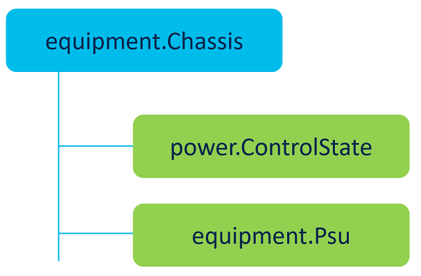

# UCSX-9508 power monitoring with Intersight API



## equipment.Chassis

Intersight API object relationships:
- reference to power control vua PowerControlState/Moid
- reference to psu modules via Psus[]

```
isctl get equipment chassis moid 632b13c876752d32362fc175

{
    "AccountMoid": "5a58c3ba3768393836cb0f1b",
    "AlarmSummary": {
        "ClassId": "compute.AlarmSummary",
        "Critical": 0,
        "ObjectType": "compute.AlarmSummary",
        "Warning": 2
    },
    "Ancestors": [],
    "Blades": [
        {
            "ClassId": "mo.MoRef",
            "Moid": "632b163d76752d323630734f",
            "ObjectType": "compute.Blade",
            "link": "https://www.intersight.com/api/v1/compute/Blades/632b163d76752d323630734f"
        },
        {
            "ClassId": "mo.MoRef",
            "Moid": "632b163e76752d32363073aa",
            "ObjectType": "compute.Blade",
            "link": "https://www.intersight.com/api/v1/compute/Blades/632b163e76752d32363073aa"
        },
        {
            "ClassId": "mo.MoRef",
            "Moid": "632b163f76752d32363073f7",
            "ObjectType": "compute.Blade",
            "link": "https://www.intersight.com/api/v1/compute/Blades/632b163f76752d32363073f7"
        },
        {
            "ClassId": "mo.MoRef",
            "Moid": "632b174e76752d323630bb47",
            "ObjectType": "compute.Blade",
            "link": "https://www.intersight.com/api/v1/compute/Blades/632b174e76752d323630bb47"
        }
    ],
    "ChassisId": 1,
    "ClassId": "equipment.Chassis",
    "ConnectionPath": "A,B",
    "ConnectionStatus": "A,B",
    "CreateTime": "2022-09-21T13:38:16.386Z",
    "Description": "Cisco Blade Server Chassis, 7U with Eight Vertical Blade Server Slots",
    "DeviceMoId": "632999466f72612d39b26942",
    "Dn": "chassis-1",
    "DomainGroupMoid": "5b2541957a7662743465d06d",
    "ExpanderModules": [
        {
            "ClassId": "mo.MoRef",
            "Moid": "632b15b476752d3236304c5c",
            "ObjectType": "equipment.ExpanderModule",
            "link": "https://www.intersight.com/api/v1/equipment/ExpanderModules/632b15b476752d3236304c5c"
        },
        {
            "ClassId": "mo.MoRef",
            "Moid": "632b15b476752d3236304c69",
            "ObjectType": "equipment.ExpanderModule",
            "link": "https://www.intersight.com/api/v1/equipment/ExpanderModules/632b15b476752d3236304c69"
        }
    ],
    "FanControl": {
        "ClassId": "mo.MoRef",
        "Moid": "632b15b476752d3236304c55",
        "ObjectType": "equipment.FanControl",
        "link": "https://www.intersight.com/api/v1/equipment/FanControls/632b15b476752d3236304c55"
    },
    "Fanmodules": [
        {
            "ClassId": "mo.MoRef",
            "Moid": "632b15b576752d3236304cf8",
            "ObjectType": "equipment.FanModule",
            "link": "https://www.intersight.com/api/v1/equipment/FanModules/632b15b576752d3236304cf8"
        },
        {
            "ClassId": "mo.MoRef",
            "Moid": "632b15b576752d3236304d08",
            "ObjectType": "equipment.FanModule",
            "link": "https://www.intersight.com/api/v1/equipment/FanModules/632b15b576752d3236304d08"
        },
        {
            "ClassId": "mo.MoRef",
            "Moid": "632b15b576752d3236304d17",
            "ObjectType": "equipment.FanModule",
            "link": "https://www.intersight.com/api/v1/equipment/FanModules/632b15b576752d3236304d17"
        },
        {
            "ClassId": "mo.MoRef",
            "Moid": "632b15b576752d3236304d27",
            "ObjectType": "equipment.FanModule",
            "link": "https://www.intersight.com/api/v1/equipment/FanModules/632b15b576752d3236304d27"
        }
    ],
    "FaultSummary": 0,
    "InventoryDeviceInfo": null,
    "Ioms": [
        {
            "ClassId": "mo.MoRef",
            "Moid": "632b13c876752d32362fc17c",
            "ObjectType": "equipment.IoCard",
            "link": "https://www.intersight.com/api/v1/equipment/IoCards/632b13c876752d32362fc17c"
        },
        {
            "ClassId": "mo.MoRef",
            "Moid": "632b13c976752d32362fc244",
            "ObjectType": "equipment.IoCard",
            "link": "https://www.intersight.com/api/v1/equipment/IoCards/632b13c976752d32362fc244"
        }
    ],
    "LocatorLed": {
        "ClassId": "mo.MoRef",
        "Moid": "632b15b476752d3236304c65",
        "ObjectType": "equipment.LocatorLed",
        "link": "https://www.intersight.com/api/v1/equipment/LocatorLeds/632b15b476752d3236304c65"
    },
    "ManagementInterface": null,
    "ManagementMode": "Intersight",
    "ModTime": "2022-10-14T10:35:56.04Z",
    "Model": "UCSX-9508",
    "Moid": "632b13c876752d32362fc175",
    "Name": "ucsX-1",
    "ObjectType": "equipment.Chassis",
    "OperReason": [],
    "OperState": "OK",
    "Owners": [
        "5a58c3ba3768393836cb0f1b",
        "632999466f72612d39b26942"
    ],
    "PartNumber": "68-6847-03  ",
    "PermissionResources": [
        {
            "ClassId": "mo.MoRef",
            "Moid": "5ddee0c26972652d33555a3b",
            "ObjectType": "organization.Organization",
            "link": "https://www.intersight.com/api/v1/organization/Organizations/5ddee0c26972652d33555a3b"
        },
        {
            "ClassId": "mo.MoRef",
            "Moid": "63493b8a6972652d33272ab6",
            "ObjectType": "organization.Organization",
            "link": "https://www.intersight.com/api/v1/organization/Organizations/63493b8a6972652d33272ab6"
        }
    ],
    "Pid": "UCSX-9508",
    "PlatformType": "",
    "PowerControlState": {
        "ClassId": "mo.MoRef",
        "Moid": "632b15b576752d3236304cf0",
        "ObjectType": "power.ControlState",
        "link": "https://www.intersight.com/api/v1/power/ControlStates/632b15b576752d3236304cf0"
    },
    "Presence": "",
    "PreviousFru": null,
    "ProductName": "Cisco UCSX 9508 Chassis",
    "PsuControl": {
        "ClassId": "mo.MoRef",
        "Moid": "632b15b576752d3236304ceb",
        "ObjectType": "equipment.PsuControl",
        "link": "https://www.intersight.com/api/v1/equipment/PsuControls/632b15b576752d3236304ceb"
    },
    "Psus": [
        {
            "ClassId": "mo.MoRef",
            "Moid": "632b15b576752d3236304ccd",
            "ObjectType": "equipment.Psu",
            "link": "https://www.intersight.com/api/v1/equipment/Psus/632b15b576752d3236304ccd"
        },
        {
            "ClassId": "mo.MoRef",
            "Moid": "632b15b576752d3236304cd4",
            "ObjectType": "equipment.Psu",
            "link": "https://www.intersight.com/api/v1/equipment/Psus/632b15b576752d3236304cd4"
        },
        {
            "ClassId": "mo.MoRef",
            "Moid": "632b15b576752d3236304cd8",
            "ObjectType": "equipment.Psu",
            "link": "https://www.intersight.com/api/v1/equipment/Psus/632b15b576752d3236304cd8"
        },
        {
            "ClassId": "mo.MoRef",
            "Moid": "632b15b576752d3236304cdd",
            "ObjectType": "equipment.Psu",
            "link": "https://www.intersight.com/api/v1/equipment/Psus/632b15b576752d3236304cdd"
        },
        {
            "ClassId": "mo.MoRef",
            "Moid": "632b15b576752d3236304ce1",
            "ObjectType": "equipment.Psu",
            "link": "https://www.intersight.com/api/v1/equipment/Psus/632b15b576752d3236304ce1"
        },
        {
            "ClassId": "mo.MoRef",
            "Moid": "632b15b576752d3236304ce5",
            "ObjectType": "equipment.Psu",
            "link": "https://www.intersight.com/api/v1/equipment/Psus/632b15b576752d3236304ce5"
        }
    ],
    "RegisteredDevice": {
        "Account": {
            "ClassId": "mo.MoRef",
            "Moid": "5a58c3ba3768393836cb0f1b",
            "ObjectType": "iam.Account",
            "link": "https://www.intersight.com/api/v1/iam/Accounts/5a58c3ba3768393836cb0f1b"
        },
        "AccountMoid": "5a58c3ba3768393836cb0f1b",
        "Ancestors": [],
        "ApiVersion": 11,
        "AppPartitionNumber": 125,
        "ClaimedByUser": {
            "ClassId": "mo.MoRef",
            "Moid": "5a58c41a3768393836cb10bc",
            "ObjectType": "iam.User",
            "link": "https://www.intersight.com/api/v1/iam/Users/5a58c41a3768393836cb10bc"
        },
        "ClaimedByUserName": "sesousa@cisco.com",
        "ClaimedTime": "2022-09-20T10:43:18.327Z",
        "ClassId": "asset.DeviceRegistration",
        "ClusterMembers": [
            {
                "ClassId": "mo.MoRef",
                "Moid": "632999466f72612d39b26945",
                "ObjectType": "asset.ClusterMember",
                "link": "https://www.intersight.com/api/v1/asset/ClusterMembers/632999466f72612d39b26945"
            },
            {
                "ClassId": "mo.MoRef",
                "Moid": "632999466f72612d39b26946",
                "ObjectType": "asset.ClusterMember",
                "link": "https://www.intersight.com/api/v1/asset/ClusterMembers/632999466f72612d39b26946"
            }
        ],
        "ConnectionId": "e53fb7c94631f12a96832ed63dcdb8d4:8e008439-dc1d-4f25-89b9-8471e6262801",
        "ConnectionReason": "",
        "ConnectionStatus": "Connected",
        "ConnectionStatusLastChangeTime": "2022-11-13T03:27:22.596Z",
        "ConnectorVersion": "1.0.11-2396",
        "CreateTime": "2022-09-20T10:43:18.301Z",
        "DeviceClaim": {
            "ClassId": "mo.MoRef",
            "Moid": "632999466f72612d39b26939",
            "ObjectType": "asset.DeviceClaim",
            "link": "https://www.intersight.com/api/v1/asset/DeviceClaims/632999466f72612d39b26939"
        },
        "DeviceConfiguration": {
            "ClassId": "mo.MoRef",
            "Moid": "632999466f72612d39b26943",
            "ObjectType": "asset.DeviceConfiguration",
            "link": "https://www.intersight.com/api/v1/asset/DeviceConfigurations/632999466f72612d39b26943"
        },
        "DeviceExternalIpAddress": "62.28.62.162",
        "DeviceHostname": [
            "ucsX"
        ],
        "DeviceIpAddress": [
            "10.90.90.13",
            "10.90.90.14"
        ],
        "DomainGroup": {
            "ClassId": "mo.MoRef",
            "Moid": "5b2541957a7662743465d06d",
            "ObjectType": "iam.DomainGroup",
            "link": "https://www.intersight.com/api/v1/iam/DomainGroups/5b2541957a7662743465d06d"
        },
        "DomainGroupMoid": "5b2541957a7662743465d06d",
        "ExecutionMode": "Normal",
        "ModTime": "2022-11-13T03:27:22.648Z",
        "Moid": "632999466f72612d39b26942",
        "ObjectType": "asset.DeviceRegistration",
        "Owners": [
            "5a58c3ba3768393836cb0f1b",
            "632999466f72612d39b26942"
        ],
        "ParentConnection": null,
        "ParentSignature": null,
        "PermissionResources": [
            {
                "ClassId": "mo.MoRef",
                "Moid": "5ddee0c26972652d33555a3b",
                "ObjectType": "organization.Organization",
                "link": "https://www.intersight.com/api/v1/organization/Organizations/5ddee0c26972652d33555a3b"
            },
            {
                "ClassId": "mo.MoRef",
                "Moid": "63493b8a6972652d33272ab6",
                "ObjectType": "organization.Organization",
                "link": "https://www.intersight.com/api/v1/organization/Organizations/63493b8a6972652d33272ab6"
            }
        ],
        "Pid": [
            "UCS-FI-6454"
        ],
        "PlatformType": "UCSFIISM",
        "ProxyApp": "astro",
        "PublicAccessKey": "-----BEGIN RSA PUBLIC KEY-----\nMIIBIjANBgkqhkiG9w0BAQEFAAOCAQ8AMIIBCgKCAQEAu/kLAlQkjn2D6AB/BiHK\n995WhFbn7Ab+t9iEW8dZm3iC/ZiG9t5FTl3N8XImac43k8VCRl31HYsCTkx/DOwG\nnFfkUsjWZ0gdILkml911anN6Y/5ziMLDclX+E+kLhFF7ZnauHPY7/Q22w6/grvUh\nnqeEGhADBu9cBf+JtMOX0qYiHbs7n5oOykx0aCPknDaWXPjSq4YJfXw2KNqAIuXa\nCiGpzX7Zvapzln9w1zMpn+t82+hwuSiw6gI6idn5gYBCXoUdADtm0rO5+h7MmzS4\nPJnVyFPFLha0Fb458xm3XEKyGgQOAirgRmiJUL2vTu7pLsCJg9JA5RVyme3XqbBJ\n1QIDAQAB\n-----END RSA PUBLIC KEY-----\n",
        "ReadOnly": false,
        "SecurityToken": null,
        "Serial": [
            "FDO26340DE3",
            "FDO26340CVC"
        ],
        "SharedScope": "",
        "Tags": [
            {
                "Key": "cisco.meta.ManagementMode",
                "Value": "Intersight"
            }
        ],
        "Vendor": "Cisco Systems, Inc."
    },
    "Revision": "0",
    "Rn": "",
    "Sasexpanders": [],
    "Serial": "FOX2611PPHP",
    "SharedScope": "",
    "Siocs": [],
    "Sku": "UCSX-9508",
    "StorageEnclosures": [],
    "Tags": [],
    "Vendor": "Cisco Systems Inc",
    "Vid": "V01",
    "VirtualDriveContainer": []
}
```

## power.ControlState

Intersight API object relationships:
- reference to equipment.Chassis via Parent/Moid

```
isctl get power controlstate  moid 632b15b576752d3236304cf0 -o json

{
    "AccountMoid": "5a58c3ba3768393836cb0f1b",
    "AllocatedPower": 0,
    "Ancestors": [
        {
            "ClassId": "mo.MoRef",
            "Moid": "632b13c876752d32362fc175",
            "ObjectType": "equipment.Chassis",
            "link": "https://www.intersight.com/api/v1/equipment/Chasses/632b13c876752d32362fc175"
        }
    ],
    "ClassId": "power.ControlState",
    "CreateTime": "2022-09-21T13:46:29.407Z",
    "DomainGroupMoid": "5b2541957a7662743465d06d",
    "EquipmentChassis": {
        "ClassId": "mo.MoRef",
        "Moid": "632b13c876752d32362fc175",
        "ObjectType": "equipment.Chassis",
        "link": "https://www.intersight.com/api/v1/equipment/Chasses/632b13c876752d32362fc175"
    },
    "ExtendedPowerCapacity": "Enabled",
    "GridMaxPower": 7000,
    "MaxRequiredPower": 8079,
    "MinRequiredPower": 4392,
    "ModTime": "2022-11-03T10:05:10.932Z",
    "Moid": "632b15b576752d3236304cf0",
    "N1MaxPower": 10500,
    "N2MaxPower": 7000,
    "NonRedundantMaxPower": 12174,
    "ObjectType": "power.ControlState",
    "Owners": [
        "5a58c3ba3768393836cb0f1b",
        "632999466f72612d39b26942"
    ],
    "Parent": {
        "ClassId": "mo.MoRef",
        "Moid": "632b13c876752d32362fc175",
        "ObjectType": "equipment.Chassis",
        "link": "https://www.intersight.com/api/v1/equipment/Chasses/632b13c876752d32362fc175"
    },
    "PermissionResources": [
        {
            "ClassId": "mo.MoRef",
            "Moid": "5ddee0c26972652d33555a3b",
            "ObjectType": "organization.Organization",
            "link": "https://www.intersight.com/api/v1/organization/Organizations/5ddee0c26972652d33555a3b"
        },
        {
            "ClassId": "mo.MoRef",
            "Moid": "63493b8a6972652d33272ab6",
            "ObjectType": "organization.Organization",
            "link": "https://www.intersight.com/api/v1/organization/Organizations/63493b8a6972652d33272ab6"
        }
    ],
    "PowerRebalancing": "Enabled",
    "PowerSaveMode": "Enabled",
    "RegisteredDevice": {
        "ClassId": "mo.MoRef",
        "Moid": "632999466f72612d39b26942",
        "ObjectType": "asset.DeviceRegistration",
        "link": "https://www.intersight.com/api/v1/asset/DeviceRegistrations/632999466f72612d39b26942"
    },
    "SharedScope": "",
    "Tags": []
}
```

## equipment.PsuControl

Intersight API object relationships:
- reference to equipment.Chassis via Parent/Moid

```
isctl get equipment psucontrol --filter "Parent/Moid eq '632b13c876752d32362fc175'"  -o json --top 100

[
    {
        "AccountMoid": "5a58c3ba3768393836cb0f1b",
        "Ancestors": [
            {
                "ClassId": "mo.MoRef",
                "Moid": "632b13c876752d32362fc175",
                "ObjectType": "equipment.Chassis",
                "link": "https://www.intersight.com/api/v1/equipment/Chasses/632b13c876752d32362fc175"
            }
        ],
        "ClassId": "equipment.PsuControl",
        "ClusterState": "",
        "CreateTime": "2022-09-21T13:46:29.432Z",
        "DeviceMoId": "632999466f72612d39b26942",
        "Dn": "chassis-1-psu-control",
        "DomainGroupMoid": "5b2541957a7662743465d06d",
        "EquipmentChassis": {
            "ClassId": "mo.MoRef",
            "Moid": "632b13c876752d32362fc175",
            "ObjectType": "equipment.Chassis",
            "link": "https://www.intersight.com/api/v1/equipment/Chasses/632b13c876752d32362fc175"
        },
        "InputPowerState": "OK",
        "InventoryDeviceInfo": null,
        "ModTime": "2022-11-03T10:05:10.94Z",
        "Model": "",
        "Moid": "632b15b576752d3236304ceb",
        "Name": "",
        "ObjectType": "equipment.PsuControl",
        "OperQualifier": "OK",
        "OperReason": [],
        "OperState": "OK",
        "OutputPowerState": "OK",
        "Owners": [
            "5a58c3ba3768393836cb0f1b",
            "632999466f72612d39b26942"
        ],
        "Parent": {
            "ClassId": "mo.MoRef",
            "Moid": "632b13c876752d32362fc175",
            "ObjectType": "equipment.Chassis",
            "link": "https://www.intersight.com/api/v1/equipment/Chasses/632b13c876752d32362fc175"
        },
        "PermissionResources": [
            {
                "ClassId": "mo.MoRef",
                "Moid": "5ddee0c26972652d33555a3b",
                "ObjectType": "organization.Organization",
                "link": "https://www.intersight.com/api/v1/organization/Organizations/5ddee0c26972652d33555a3b"
            },
            {
                "ClassId": "mo.MoRef",
                "Moid": "63493b8a6972652d33272ab6",
                "ObjectType": "organization.Organization",
                "link": "https://www.intersight.com/api/v1/organization/Organizations/63493b8a6972652d33272ab6"
            }
        ],
        "Presence": "",
        "PreviousFru": null,
        "Redundancy": "N+1",
        "RegisteredDevice": {
            "ClassId": "mo.MoRef",
            "Moid": "632999466f72612d39b26942",
            "ObjectType": "asset.DeviceRegistration",
            "link": "https://www.intersight.com/api/v1/asset/DeviceRegistrations/632999466f72612d39b26942"
        },
        "Revision": "",
        "Rn": "",
        "Serial": "",
        "SharedScope": "",
        "Tags": [],
        "Vendor": ""
    }
]
```

## equipment.Psu

Intersight API object relationships:
- reference to equipment.Chassis via Parent/Moid

```
isctl get equipment psu --filter "Parent/Moid eq '632b13c876752d32362fc175'"  -o json --top 100

{
    "AccountMoid": "5a58c3ba3768393836cb0f1b",
    "Ancestors": [
        {
            "ClassId": "mo.MoRef",
            "Moid": "632b13c876752d32362fc175",
            "ObjectType": "equipment.Chassis",
            "link": "https://www.intersight.com/api/v1/equipment/Chasses/632b13c876752d32362fc175"
        }
    ],
    "ClassId": "equipment.Psu",
    "ComputeRackUnit": null,
    "CreateTime": "2022-09-21T13:46:29.296Z",
    "Description": "2800W AC PSU for UCSX 9508 Blade Server Chassis",
    "DeviceMoId": "632999466f72612d39b26942",
    "Dn": "chassis-1-psu-1",
    "DomainGroupMoid": "5b2541957a7662743465d06d",
    "EquipmentChassis": {
        "ClassId": "mo.MoRef",
        "Moid": "632b13c876752d32362fc175",
        "ObjectType": "equipment.Chassis",
        "link": "https://www.intersight.com/api/v1/equipment/Chasses/632b13c876752d32362fc175"
    },
    "EquipmentFex": null,
    "EquipmentRackEnclosure": null,
    "InventoryDeviceInfo": null,
    "ModTime": "2022-11-03T10:05:10.815Z",
    "Model": "UCSX-PSU-2800AC",
    "Moid": "632b15b576752d3236304ccd",
    "Name": "",
    "NetworkElement": null,
    "ObjectType": "equipment.Psu",
    "OperReason": [],
    "OperState": "OK",
    "Owners": [
        "5a58c3ba3768393836cb0f1b",
        "632999466f72612d39b26942"
    ],
    "Parent": {
        "ClassId": "mo.MoRef",
        "Moid": "632b13c876752d32362fc175",
        "ObjectType": "equipment.Chassis",
        "link": "https://www.intersight.com/api/v1/equipment/Chasses/632b13c876752d32362fc175"
    },
    "PartNumber": "341-0772-01 ",
    "PermissionResources": [
        {
            "ClassId": "mo.MoRef",
            "Moid": "5ddee0c26972652d33555a3b",
            "ObjectType": "organization.Organization",
            "link": "https://www.intersight.com/api/v1/organization/Organizations/5ddee0c26972652d33555a3b"
        },
        {
            "ClassId": "mo.MoRef",
            "Moid": "63493b8a6972652d33272ab6",
            "ObjectType": "organization.Organization",
            "link": "https://www.intersight.com/api/v1/organization/Organizations/63493b8a6972652d33272ab6"
        }
    ],
    "Pid": "UCSX-PSU-2800AC",
    "Presence": "equipped",
    "PreviousFru": null,
    "PsuFwVersion": "2.6.0.0,2.6.0.0",
    "PsuId": 1,
    "PsuInputSrc": "ACWideRange",
    "PsuType": "AC",
    "PsuWattage": "2800",
    "RegisteredDevice": {
        "ClassId": "mo.MoRef",
        "Moid": "632999466f72612d39b26942",
        "ObjectType": "asset.DeviceRegistration",
        "link": "https://www.intersight.com/api/v1/asset/DeviceRegistrations/632999466f72612d39b26942"
    },
    "Revision": "0",
    "Rn": "",
    "Serial": "DTM2611028K",
    "SharedScope": "",
    "Sku": "UCSX-PSU-2800AC",
    "Tags": [],
    "Vendor": "Cisco Systems Inc",
    "Vid": "V00",
    "Voltage": "226"
}
```